# Registro de medições

Valores medidos a cada ciclo, com interpretação. As fórmulas e faixas de decisão estão no [plano de medição](plano-de-medicao.md), e os dados brutos ficam em [`dados/gestao/`](https://github.com/FCTE-Qualidade-de-Software-1/2026-2_T02_FRANCES_ALLEN/tree/main/dados/gestao). Situação: (OK) dentro da faixa · (A) alerta · (AN) ação necessária · (--) não mensurável no ciclo.

| Ciclo | Período | Marco | Coleta |
|-------|---------|-------|--------|
| 0 (retroativo) | 05/10 a 18/10/2026 | Estruturação e produção das Fases 1 e 2 | 25/10/2026, a partir do `git log` |
| 1 | 19/10 a 25/10/2026 | Milestone E1 (vence em 25/10, 21h) | 25/10/2026, às 20h30. Três commits do ciclo entraram depois dessa hora e foram incorporados retroativamente na coleta de 28/10 |
| 2 | 26/10 a 01/11/2026 | Fechamento da E1 (*release* `v0.1`) | Parcial em 28/10/2026. A coleta de 01/11 não foi feita no dia e foi **fechada retroativamente em 13/11**, a partir do `git log` e da API do GitHub |
| 3 (retroativo) | 02/11 a 08/11/2026 | Abertura da E2: milestones e issues da Fase 3 e da Fase 4 (04/11) | Coletas de 04/11 e 08/11 não feitas no dia. **Medido retroativamente em 13/11**, a partir do `git log` e da API do GitHub |
| 4 | 09/11 a 15/11/2026 | Ponto de controle interno de 11/11 e prazo interno da Fase 3 (14/11) | Parcial em 13/11/2026, às 21h46. A coleta de 15/11 não foi feita no dia e foi **fechada retroativamente em 19/11**, a partir do `git log` e da API do GitHub |
| 5 (em curso) | 16/11 a 22/11/2026 | Entrega final da E2 (milestone vence em 21/11, às 21h; entrega em 22/11) | **Parcial em 19/11/2026, às 10h55** (data de corte), a partir do `git log` de todos os branches publicados e da API do GitHub. A coleta completa é em 22/11 |

## 1. Painel dos ciclos

| Métrica | Ciclo 0 | Ciclo 1 | Ciclo 2 | Ciclo 3 | Ciclo 4 | Ciclo 5 (parcial, até 19/11) |
|---------|---------|---------|---------|---------|---------|------------------------------|
| CP1 Comprometido x concluído | (--) sem backlog formal | (--) 11,1% concluído (issues criadas com base no artigo.) | (OK) 100% (18 de 18), desvio de 0 p.p., mas concluído **depois** do vencimento | (AN) E2 Fase 3: 1 de 7 (14,3%) com 39,0% do período, desvio de 24,7 p.p. | (AN) E2 Fase 3: 6 de 7 (85,7%) com 100% do período, desvio de 14,3 p.p. | (AN) E2 Entrega final: 0 de 6 com 86,0% do período, desvio de 86,0 p.p.; #25 ainda aberta |
| CP2 SPI (hora/valor) | (--) sem linha de base | (AN) 0,05 | (OK) 1,00 na data de corte · 0,05 no vencimento · atraso de 1 a 3 dias | (AN) 0,37 (PV 5,5 h · EV 2 h) | (A) 0,86 (PV 14 h · EV 12 h); 0,83 por contagem de issues | (AN) 0,00 (PV 22,4 h · EV 0 h); 0 de 3 por contagem |
| RC1 Variação de esforço | (--) horas não registradas | (--) horas não registradas | (AN) 0 de 6 integrantes registraram horas até o prazo da D05 | (--) nenhuma issue fechada com horas registradas | (AN) +100% na #20 (4 h reais / 2 h estimadas) e +50% na #21; equipe não mensurável | (--) nenhuma issue fechada; a #27 já tem 7 h das 5 h estimadas |
| RC2 CPI (hora/valor) | (--) horas não registradas | (--) horas não registradas | (--) sem `AC`, por falta das horas reais. Custo planejado da E1: **R$2.100** (42 h × R$50) | (--) `AC` de 2 h (R$100) sem relação com a issue fechada | (AN) 0,57 nas entregas com horas (EV 4 h / AC 7 h = R$350) | (--) sem EV no ciclo; AC de 7 h no `main` (R$350) e 5,8 h só em branch |
| RC3 Contribuição individual | (AN) 0% a 34,8% (*proxy*: commits) | (A) 7,1% a 28,6% (carga planejada) | (AN) larigs 66,7% · Guilherme-Moura 33,3% · demais 0% (*proxy*: commits) | (AN) Faehzin 50% · LucasAvelar2711 50% · demais 0% (*proxy*: commits) | (AN) LucasAvelar2711 76,5% · Faehzin 17,6% · larigs 5,9% (*proxy*: commits) | (AN) larigs 66,7% · Faehzin 25,0% · LucasAvelar2711 8,3% (*proxy*: commits, todos os branches) |
| DP1 *Lead time* | (--) sem issues | (AN) média de 3,1 dias nas fechadas; abertas com 6,2 dias | (AN) 9,3 dias nas 16 declaradas em 28/10; nenhuma fechada no GitHub no ciclo | (AN) 16,0 dias no GitHub (9,3 declarados) nas 16 fechadas; abertas com 4,4 dias | (AN) 10,8 dias nas 5 fechadas; abertas com 11,4 dias | (AN) nenhuma fechada; 7 abertas com 14,9 dias |
| DP2 Razão saída/chegada | (--) sem issues | (AN) 0,11 (2 saídas para 18 chegadas) | (A) 16 saídas e 0 chegadas: razão indefinida. WIP de 0 na data de corte | (OK) 1,33 (16 saídas, 12 chegadas), mas as saídas só regularizam o ciclo 2. WIP de 12 (2,0 por integrante) | (A) 5 saídas e 0 chegadas: razão indefinida. WIP de 7 (1,2 por integrante) | (A) 0 saídas e 0 chegadas: razão indefinida. WIP de 7 (1,2 por integrante) |
| DP3 Índice de pico | (AN) 82,6% em 18/10 | (AN) 100% em 25/10 (3 commits, medido retroativamente) | (AN) 66,7% em 28/10, 2 dias ativos em 7 | (AN) 100% em 04/11, 1 dia ativo em 7 | (AN) 76,5% em 14/11, 4 dias ativos em 7 | (A) 58,3% em 18/11, 3 dias ativos em 4 |
| DP4 Retrabalho | (AN) 39,1% | (AN) 66,7% (2 de 3 commits, medido retroativamente) | (AN) 66,7% (2 de 3 commits) · nenhum PR no período | (AN) 50% (2 de 4 commits) | (AN) 52,9% por commit (9 de 17) · PR #33 sem revisão formal, revisado em comentário | (A) 25,0% por commit (3 de 12) · nenhum PR; 11 commits em branches sem PR |

## 2. Ciclo 0 (retroativo): 05/10 a 18/10

### 2.1 Medições

| Métrica | Valor | Limite | Situação | Interpretação |
|---------|-------|--------|:--------:|---------------|
| CP1 / CP2 | Não aplicável | - | (--) | Não existiam milestone nem issues. O trabalho não tinha compromisso registrado, e a ausência dessa informação já é um achado (*lack of information*, PSM cap. 2) |
| RC1 / RC2 | Não aplicável | - | (--) | Só um membro declarou horas. Revisão necessária. |
| RC3 (*proxy*: commits) | Faehzin 34,8% · LucasAvelar2711 26,1% · Guilherme-Moura 17,4% · larigs 13,0% · GuilhermeMM3 8,7% · MrBolt2005 0% | 13% a 20% | (AN) | Distribuição desigual. A estruturação inicial do repositório concentrou commits e trabalho, considerando que João Felipe trabalhou no overleaf |
| RC3 (*proxy*: linhas, sem os commits de estruturação) | LucasAvelar2711 44,4% · Faehzin 20,9% · larigs 16,5% · Guilherme-Moura 16,1% · GuilhermeMM3 2,2% · MrBolt2005 0% | 13% a 20% | (AN) | Em volume de conteúdo, os objetivos GQM (G2 e diagrama) concentraram a produção |
| DP3 Índice de pico | 19 de 23 commits em 18/10 = **82,6%**. 4 dias ativos em 14 | ≤ 40% | (AN) | O trabalho se acumulou em um único dia, às vésperas da criação das issues da E1 |
| DP4 Retrabalho | 9 de 23 commits = **39,1%** (em 18/10: 8 de 19 = 42,1%) | ≤ 20% | (AN) | O pico gerou revisão de estrutura em sequência: faixas de nível com buracos, G2 realinhado às sete subcaracterísticas, troca de modificabilidade por testabilidade em C3, correções de redação |
| Revisão de PR | -- | - | (--) | Não houve revisão formal. |

### 2.2 Gráficos

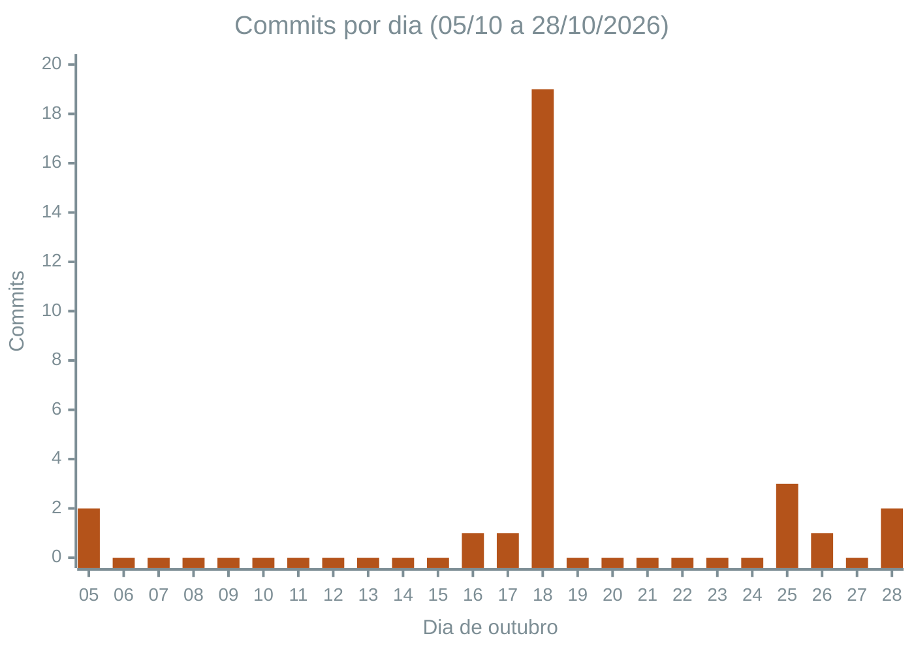
```mermaid
---
config:
  themeVariables:
    xyChart:
      plotColorPalette: "#B4531A"
      titleColor: "#7D8E95"
      xAxisLabelColor: "#7D8E95"
      xAxisTitleColor: "#7D8E95"
      xAxisLineColor: "#7D8E95"
      xAxisTickColor: "#7D8E95"
      yAxisLabelColor: "#7D8E95"
      yAxisTitleColor: "#7D8E95"
      yAxisLineColor: "#7D8E95"
      yAxisTickColor: "#7D8E95"
      backgroundColor: "transparent"
---
xychart-beta
    title "Commits por dia (05/10 a 28/10/2026)"
    x-axis "Dia de outubro" [05, 06, 07, 08, 09, 10, 11, 12, 13, 14, 15, 16, 17, 18, 19, 20, 21, 22, 23, 24, 25, 26, 27, 28]
    y-axis "Commits" 0 --> 20
    bar [2, 0, 0, 0, 0, 0, 0, 0, 0, 0, 0, 1, 1, 19, 0, 0, 0, 0, 0, 0, 3, 1, 0, 2]
```

_Figura 1 - Commits por dia no repositório, sem os commits de merge, de 05/10 a 28/10 (29 commits). Os 23 commits até 18/10 são o ciclo 0, os 3 de 25/10 são o ciclo 1 e os 3 de 26 a 28/10 são o parcial do ciclo 2. A barra de 25/10 foi acrescentada na coleta de 28/10: na coleta do próprio ciclo 1 ela aparecia como zero, porque os commits entraram depois do horário da coleta. Indicador DP3. Fonte: [`commits.csv`](https://github.com/FCTE-Qualidade-de-Software-1/2026-2_T02_FRANCES_ALLEN/blob/main/dados/gestao/commits.csv)._

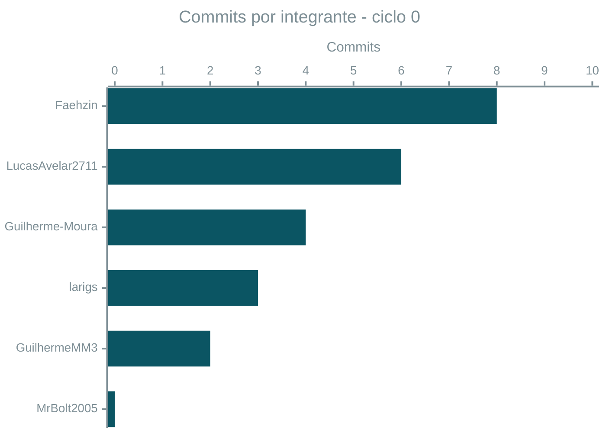
```mermaid
---
config:
  themeVariables:
    xyChart:
      plotColorPalette: "#0B5563"
      titleColor: "#7D8E95"
      xAxisLabelColor: "#7D8E95"
      xAxisTitleColor: "#7D8E95"
      xAxisLineColor: "#7D8E95"
      xAxisTickColor: "#7D8E95"
      yAxisLabelColor: "#7D8E95"
      yAxisTitleColor: "#7D8E95"
      yAxisLineColor: "#7D8E95"
      yAxisTickColor: "#7D8E95"
      backgroundColor: "transparent"
---
xychart-beta horizontal
    title "Commits por integrante - ciclo 0"
    x-axis ["Faehzin", "LucasAvelar2711", "Guilherme-Moura", "larigs", "GuilhermeMM3", "MrBolt2005"]
    y-axis "Commits" 0 --> 10
    bar [8, 6, 4, 3, 2, 0]
```

_Figura 2 - Commits por integrante no ciclo 0, como proxy do RC3 até o registro de horas. Fonte: `commits.csv`._

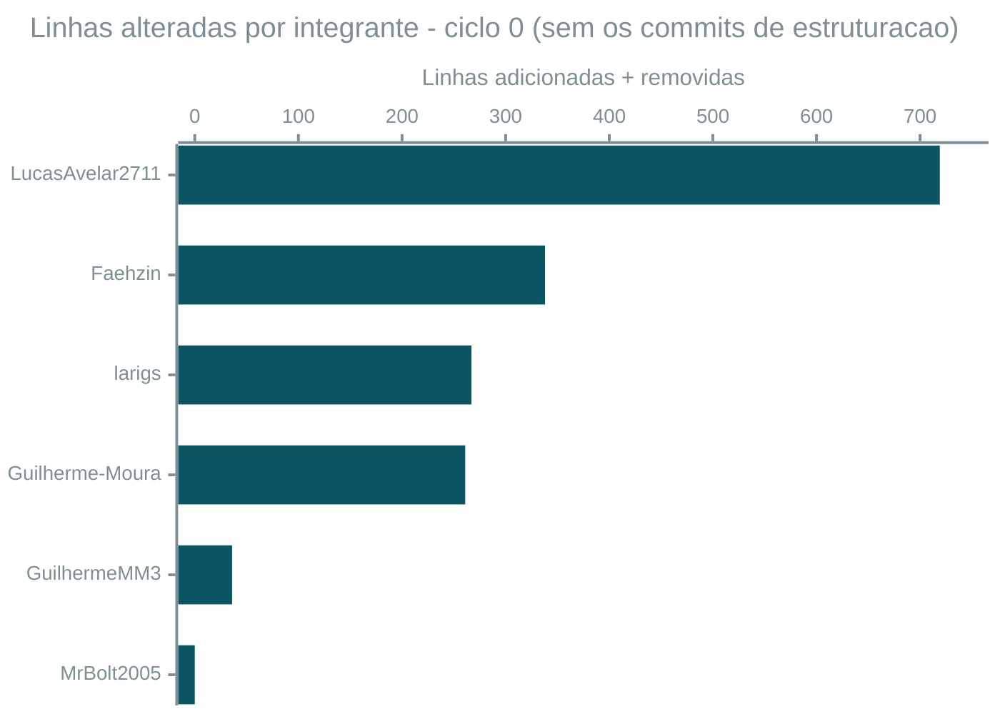
```mermaid
---
config:
  themeVariables:
    xyChart:
      plotColorPalette: "#0B5563"
      titleColor: "#7D8E95"
      xAxisLabelColor: "#7D8E95"
      xAxisTitleColor: "#7D8E95"
      xAxisLineColor: "#7D8E95"
      xAxisTickColor: "#7D8E95"
      yAxisLabelColor: "#7D8E95"
      yAxisTitleColor: "#7D8E95"
      yAxisLineColor: "#7D8E95"
      yAxisTickColor: "#7D8E95"
      backgroundColor: "transparent"
---
xychart-beta horizontal
    title "Linhas alteradas por integrante - ciclo 0 (sem os commits de estruturacao)"
    x-axis ["LucasAvelar2711", "Faehzin", "larigs", "Guilherme-Moura", "GuilhermeMM3", "MrBolt2005"]
    y-axis "Linhas adicionadas + removidas" 0 --> 750
    bar [719, 338, 267, 261, 36, 0]
```

_Figura 3 - Volume de conteúdo por integrante no ciclo 0, em linhas adicionadas mais removidas, excluídos os três commits de estruturação do repositório (1.658 linhas das 3.279 do ciclo). É o segundo *proxy* do RC3 e corresponde aos percentuais da tabela 2.1: LucasAvelar2711 44,4%, Faehzin 20,9%, larigs 16,5%, Guilherme-Moura 16,1% e GuilhermeMM3 2,2%, de um total de 1.621 linhas. **Não há gráfico de horas nem de custo neste ciclo:** não existia linha de base de horas e nenhum integrante registrou esforço, então RC1 e RC2 não são calculáveis para o período. Fonte: [`commits.csv`](https://github.com/FCTE-Qualidade-de-Software-1/2026-2_T02_FRANCES_ALLEN/blob/main/dados/gestao/commits.csv) (colunas `linhas_adicionadas` e `linhas_removidas`)._
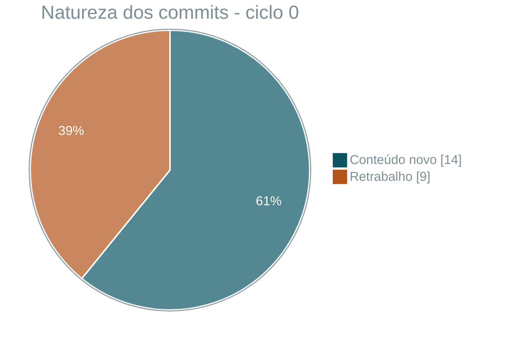
```mermaid
---
config:
  themeVariables:
    pie1: "#0B5563"
    pie2: "#B4531A"
    pieStrokeColor: "#FFFFFF"
    pieOuterStrokeColor: "#7D8E95"
    pieSectionTextColor: "#FFFFFF"
    pieTitleTextColor: "#7D8E95"
    pieLegendTextColor: "#7D8E95"
---
pie showData title Natureza dos commits - ciclo 0
    "Conteúdo novo" : 14
    "Retrabalho" : 9
```

_Figura 4 - Proporção de commits de retrabalho no ciclo 0. Indicador DP4. Fonte: `commits.csv` (coluna `tipo`)._

## 3. Ciclo 1: 19/10 a 25/10 (milestone E1)

### 3.1 Medições

| Métrica | Valor | Limite | Situação | Interpretação |
|---------|-------|--------|:--------:|---------------|
| CP1 Comprometido x concluído | 2 de 18 issues = **11,1%**, com 100% do período decorrido (desvio de 88,9 p.p.). Issues do artigo: 0 de 9 | desvio ≤ 5 p.p. | (AN) | Backlog aberto pois se relaciona à completude do artigo. |
| CP2 SPI | PV = 42 h · EV = 2 h (#11 e #15) · **SPI = 0,05** | ≥ 0,90 | (AN) | Só 5% do valor planejado foi entregue formalmente. O caminho crítico é o artigo, que concentra 24 h das 42 h |
| RC1 / RC2 | Não mensurável | - | (--) | -- |
| RC3 (carga planejada) | MrBolt2005 28,6% (12 h) · Guilherme-Moura 21,4% (9 h) · GuilhermeMM3 16,7% (7 h) · Faehzin 14,3% (6 h) · larigs 11,9% (5 h) · LucasAvelar2711 7,1% (3 h) | 13% a 20% | (A) | --|
| DP1 *Lead time* | Fechadas: média de **3,1 dias** (#15 com 0,01 dia e #11 com 6,2 dias) · abertas: idade média de **6,2 dias** | ≤ 3 dias | (AN) | As duas issues fechadas são as de menor esforço (1 h cada). A idade das 16 abertas já estava acima do limite na data de corte |
| DP2 Razão saída/chegada | 2 saídas para 18 chegadas = **0,11** · WIP de 16 issues (**2,7** por integrante) | ≥ 0,90 · WIP ≤ 2 | (AN) | Todo o backlog da E1 entrou de uma vez em 19/10 e quase nada saiu. O WIP nasceu acima do limite depois fixado na D04 |
| DP3 Índice de pico (retroativo) | 3 de 3 commits em 25/10 = **100%**. 1 dia ativo em 7 | ≤ 40% | (AN) | **Correção retroativa.** Na coleta de 25/10, às 20h30, o ciclo não tinha commits no repositório. Os três commits do ciclo saíram todos em 25/10, dois deles depois da coleta: [`3ce20cc`](https://github.com/FCTE-Qualidade-de-Software-1/2026-2_T02_FRANCES_ALLEN/commit/3ce20cc) às 20h36, [`31cff66`](https://github.com/FCTE-Qualidade-de-Software-1/2026-2_T02_FRANCES_ALLEN/commit/31cff66) às 21h55 e [`3304199`](https://github.com/FCTE-Qualidade-de-Software-1/2026-2_T02_FRANCES_ALLEN/commit/3304199) às 22h26. O padrão de rajada do ciclo 0 se repetiu, agora na véspera da entrega |
| DP4 Retrabalho (retroativo) | 2 de 3 commits = **66,7%** | ≤ 20% | (AN) | `31cff66` reescreve a H1.5 em Jaccard 0,70 para coincidir com o nível Bom de M1.5.2 e `3304199` enxuga o texto da Fase 2 e realinha F05: as duas correções vêm da revisão estrutural da D02 |
| Rastreabilidade | 0 de 3 commits com `Closes #N` · nenhum PR no ciclo | 100% | (AN) | O trabalho do artigo ocorreu fora do repositório (Overleaf) e as correções da Fase 2 entraram direto no `main` |

### 3.2 Gráficos

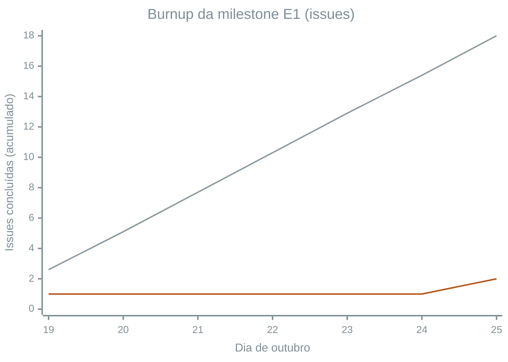
```mermaid
---
config:
  themeVariables:
    xyChart:
      plotColorPalette: "#8C9BA1, #B4531A"
      titleColor: "#7D8E95"
      xAxisLabelColor: "#7D8E95"
      xAxisTitleColor: "#7D8E95"
      xAxisLineColor: "#7D8E95"
      xAxisTickColor: "#7D8E95"
      yAxisLabelColor: "#7D8E95"
      yAxisTitleColor: "#7D8E95"
      yAxisLineColor: "#7D8E95"
      yAxisTickColor: "#7D8E95"
      backgroundColor: "transparent"
---
xychart-beta
    title "Burnup da milestone E1 (issues)"
    x-axis "Dia de outubro" [19, 20, 21, 22, 23, 24, 25]
    y-axis "Issues concluídas (acumulado)" 0 --> 18
    line [2.6, 5.1, 7.7, 10.3, 12.9, 15.4, 18]
    line [1, 1, 1, 1, 1, 1, 2]
```

_Figura 5 - Burnup da E1: linha cinza = planejado (18 issues distribuídas de forma linear até 25/10), linha terracota = concluído. Indicador CP1. Fonte: [`linha-de-base-e1.csv`](https://github.com/FCTE-Qualidade-de-Software-1/2026-2_T02_FRANCES_ALLEN/blob/main/dados/gestao/linha-de-base-e1.csv)._

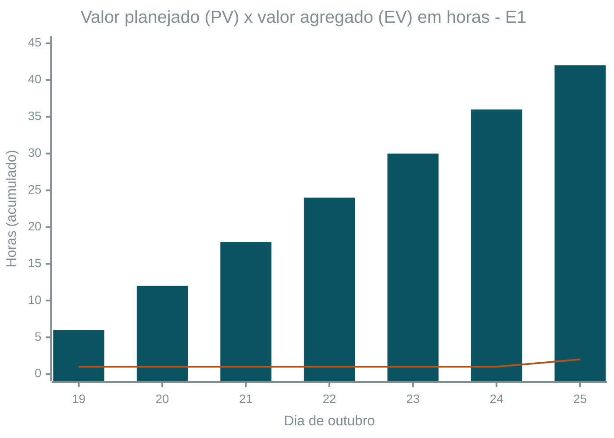
```mermaid
---
config:
  themeVariables:
    xyChart:
      plotColorPalette: "#0B5563, #B4531A"
      titleColor: "#7D8E95"
      xAxisLabelColor: "#7D8E95"
      xAxisTitleColor: "#7D8E95"
      xAxisLineColor: "#7D8E95"
      xAxisTickColor: "#7D8E95"
      yAxisLabelColor: "#7D8E95"
      yAxisTitleColor: "#7D8E95"
      yAxisLineColor: "#7D8E95"
      yAxisTickColor: "#7D8E95"
      backgroundColor: "transparent"
---
xychart-beta
    title "Valor planejado (PV) x valor agregado (EV) em horas - E1"
    x-axis "Dia de outubro" [19, 20, 21, 22, 23, 24, 25]
    y-axis "Horas (acumulado)" 0 --> 45
    bar [6, 12, 18, 24, 30, 36, 42]
    line [1, 1, 1, 1, 1, 1, 2]
```

_Figura 6 - Análise de valor agregado da E1: barras = PV, linha = EV. SPI = EV / PV. Indicador CP2. Fonte: `linha-de-base-e1.csv`._

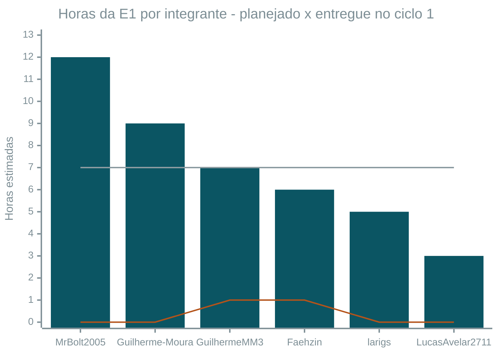
```mermaid
---
config:
  themeVariables:
    xyChart:
      plotColorPalette: "#0B5563, #B4531A, #8C9BA1"
      titleColor: "#7D8E95"
      xAxisLabelColor: "#7D8E95"
      xAxisTitleColor: "#7D8E95"
      xAxisLineColor: "#7D8E95"
      xAxisTickColor: "#7D8E95"
      yAxisLabelColor: "#7D8E95"
      yAxisTitleColor: "#7D8E95"
      yAxisLineColor: "#7D8E95"
      yAxisTickColor: "#7D8E95"
      backgroundColor: "transparent"
---
xychart-beta
    title "Horas da E1 por integrante - planejado x entregue no ciclo 1"
    x-axis ["MrBolt2005", "Guilherme-Moura", "GuilhermeMM3", "Faehzin", "larigs", "LucasAvelar2711"]
    y-axis "Horas estimadas" 0 --> 13
    bar [12, 9, 7, 6, 5, 3]
    line [0, 0, 1, 1, 0, 0]
    line [7, 7, 7, 7, 7, 7]
```

_Figura 7 - Carga da E1 por integrante: barras = horas planejadas (42 h no total), linha terracota = horas entregues até 25/10 (2 h, das issues #11 e #15) e linha cinza = distribuição ideal de 7 h por pessoa, ou 16,7%. É o RC3 pela carga planejada somado ao EV do CP2 por integrante. Duas ressalvas: as horas são **estimadas**, porque nenhuma hora real foi registrada, e a atribuição é a de 19/10, anterior ao remanejamento de 28/10 ([D08](decisoes.md#d08-remanejar-as-divisoes-de-trabalho-da-equipe)). Fonte: `linha-de-base-e1.csv`._

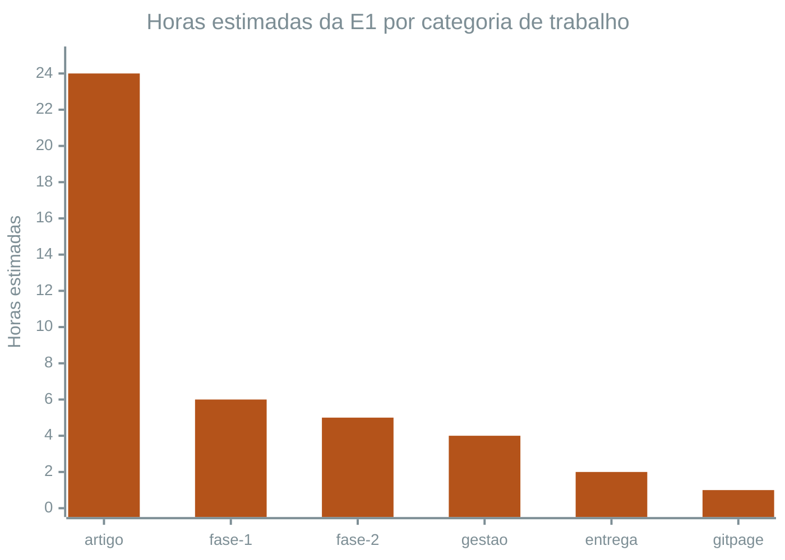
```mermaid
---
config:
  themeVariables:
    xyChart:
      plotColorPalette: "#B4531A"
      titleColor: "#7D8E95"
      xAxisLabelColor: "#7D8E95"
      xAxisTitleColor: "#7D8E95"
      xAxisLineColor: "#7D8E95"
      xAxisTickColor: "#7D8E95"
      yAxisLabelColor: "#7D8E95"
      yAxisTitleColor: "#7D8E95"
      yAxisLineColor: "#7D8E95"
      yAxisTickColor: "#7D8E95"
      backgroundColor: "transparent"
---
xychart-beta
    title "Horas estimadas da E1 por categoria de trabalho"
    x-axis ["artigo", "fase-1", "fase-2", "gestao", "entrega", "gitpage"]
    y-axis "Horas estimadas" 0 --> 25
    bar [24, 6, 5, 4, 2, 1]
```

_Figura 8 - Distribuição das 42 h da E1 por categoria. O artigo concentra 24 h, 57% do valor planejado da entrega, e é o caminho crítico citado na [D03](decisoes.md#d03-recalcular-esforco-pro-artigo): no fim do ciclo 1 nenhuma das suas 9 issues estava fechada, o que por si só explica o SPI de 0,05. Fonte: `linha-de-base-e1.csv` (coluna `categoria`)._

## 4. Ciclo 2 (parcial): 26/10 a 28/10

Coleta do **ponto de controle de quarta-feira** definido na [D04](decisoes.md#d04-readaptar-o-processo-de-desenvolvimento-e-pesquisa). Escopo previsto para esta coleta: **CP1, CP2, DP2 e as horas retroativas dos ciclos 0 e 1**. As demais métricas ficam para a coleta completa de domingo. Data de corte: **28/10/2026, 21h**.

### 4.1 Contexto da coleta

| Item | Registro |
|------|----------|
| Fechamento da E1 | As **18 issues da milestone E1 foram declaradas concluídas** no ponto de controle. A entrega saiu na *release* [`v0.1`](https://github.com/FCTE-Qualidade-de-Software-1/2026-2_T02_FRANCES_ALLEN/releases/tag/v0.1) ("Release E1 - Ponto de Controle 1"), publicada em **26/10 às 20h25**, sobre o commit [`030f62d`](https://github.com/FCTE-Qualidade-de-Software-1/2026-2_T02_FRANCES_ALLEN/commit/030f62d). A retrospectiva da E1 entrou no repositório em 28/10 ([`5741d9c`](https://github.com/FCTE-Qualidade-de-Software-1/2026-2_T02_FRANCES_ALLEN/commit/5741d9c) e [`f25cb3d`](https://github.com/FCTE-Qualidade-de-Software-1/2026-2_T02_FRANCES_ALLEN/commit/f25cb3d)) |
| Remanejamento das divisões | A equipe **remanejou as divisões de trabalho** no ponto de controle. A coluna `responsavel` da [`linha-de-base-e1.csv`](https://github.com/FCTE-Qualidade-de-Software-1/2026-2_T02_FRANCES_ALLEN/blob/main/dados/gestao/linha-de-base-e1.csv) passa a valer apenas como registro histórico do planejamento da E1: ela não descreve quem executou o trabalho no fechamento e não vale para a E2 (ver [D08](decisoes.md#d08-remanejar-as-divisoes-de-trabalho-da-equipe)) |
| Onde a decisão foi tomada | O ponto de controle **não ocorreu em sala**, por falta de tempo de aula, e correu **fora de sala, de forma assíncrona**, com manifestação de parte da equipe. É o mesmo fator que explica o resultado das horas retroativas abaixo (ver [D09](decisoes.md#d09-canal-assincrono-com-prazo-de-resposta)) |
| Qualidade do dado (importante) | O fechamento das issues foi **declarado em lote** no ponto de controle e **não foi registrado no GitHub**: em consulta à API em 04/11, a milestone E1 ainda constava `open`, com 16 das 18 issues no estado `OPEN` e sem `closedAt`. CP1 e CP2 desta coleta vêm da **declaração do ponto de controle e da *release* `v0.1`**, não do estado das issues na API. É exatamente a falha de rastreabilidade que a [D06](decisoes.md#d06-rastreabilidade-do-trabalho-no-repositorio) deveria ter corrigido, e ela rebaixa a confiança de CP1, CP2, DP1 e DP2 de "medido" para "declarado" |

**Dados brutos desta coleta.** A [`linha-de-base-e1.csv`](https://github.com/FCTE-Qualidade-de-Software-1/2026-2_T02_FRANCES_ALLEN/blob/main/dados/gestao/linha-de-base-e1.csv) ganhou duas colunas, que separam o que foi medido do que foi declarado: `fechada_em` continua sendo a data de fechamento **registrada no GitHub** (preenchida só para as issues #11 e #15) e `concluida_em_declarado` traz a data de conclusão **declarada no ponto de controle** (28/10 para as 16 restantes), com `status_28_10` indicando qual das duas vale para cada issue. A [`commits.csv`](https://github.com/FCTE-Qualidade-de-Software-1/2026-2_T02_FRANCES_ALLEN/blob/main/dados/gestao/commits.csv) recebeu as 6 linhas dos ciclos 1 e 2 que faltavam, com a mesma classificação manual de `tipo` descrita no plano de medição. Como `concluida_em_declarado` é a data do ponto de controle e não a da conclusão real de cada item, o *lead time* (DP1) calculado sobre ela é um **limite superior**.

### 4.2 Medições

| Métrica | Valor | Limite | Situação | Interpretação |
|---------|-------|--------|:--------:|---------------|
| CP1 Comprometido x concluído | `I_conc` = 18 de `I_comp` = 18 = **100% concluído**, com 100% do período decorrido: **desvio de 0 p.p.** (era 88,9 p.p. em 25/10) | desvio ≤ 5 p.p. | (OK) | O escopo da E1 foi entregue **integralmente, mas fora do prazo**. As 9 issues do artigo, que no ciclo 1 estavam todas abertas, foram concluídas em três dias. O indicador entra na faixa OK porque, passado o fim da milestone, `%Planejado` satura em 100% e o desvio se anula: o atraso não aparece mais no CP1 e tem de ser lido no CP2 |
| CP2 SPI na data de corte | `PV` = 42 h (saturado no total da E1) · `EV` = 42 h · **SPI = 1,00** | ≥ 0,90 | (OK) | Todo o valor planejado da E1 virou entrega |
| CP2 SPI no vencimento | No vencimento da milestone (25/10, 21h): `PV` = 42 h · `EV` = 2 h · **SPI = 0,05** | ≥ 0,90 | (AN) | É este o número que descreve o prazo da E1. O SPI converge para 1,00 em qualquer projeto que termine, por mais atrasado que esteja, então o atraso tem de ser registrado em dias, na linha abaixo |
| CP2 Variação de prazo (em dias) | *Release* `v0.1` em 26/10, 20h25 = **~1 dia** após o vencimento · fechamento formal das issues até 28/10 = **3 dias** após o vencimento. Em um ciclo de 7 dias, 14% a 43% de atraso | - | (A) | Efeito direto da [D03](decisoes.md#d03-recalcular-esforco-pro-artigo): com o cronograma do artigo recalculado, as 24 h do caminho crítico saíram, mas estouraram o prazo da E1 |
| DP2 Vazão | **16 saídas** em 3 dias (as outras 2 das 18 já haviam saído no ciclo 1). Extrapolado, 37 issues/semana | - | (A) | Não é vazão sustentável: é a drenagem, de uma só vez, do backlog acumulado de 18 issues. Serve como teto, não como capacidade da equipe |
| DP2 Razão saída/chegada | **0 chegadas** e 16 saídas: razão **indefinida** (divisão por zero) | ≥ 0,90 | (A) | A razão não é calculável porque nenhuma issue nova foi aberta no ciclo. Olhando só o fluxo de saída, o indicador inverteu em relação ao ciclo 1 (0,11): o problema deixou de ser trabalho que não sai e passou a ser trabalho novo que não entra |
| DP2 Trabalho em andamento (WIP) | **0 issues abertas** na data de corte, contra 16 em 25/10. 0 por integrante | ≤ 2 por integrante | (A) | O limite da D04 passou a ser respeitado, mas pelo motivo errado: o WIP é zero porque o backlog da E1 esvaziou e **o da E2 não existe**. Com WIP zero e nenhuma chegada, o ciclo seguinte começa sem trabalho comprometido e CP1, CP2, DP1 e DP2 voltam a ser não mensuráveis (ver [D10](decisoes.md#d10-planejar-o-ciclo-no-github-antes-de-ele-comecar)) |
| Horas retroativas dos ciclos 0 e 1 | [`esforco.csv`](https://github.com/FCTE-Qualidade-de-Software-1/2026-2_T02_FRANCES_ALLEN/blob/main/dados/gestao/esforco.csv) continua **só com o cabeçalho**: **0 de 6 integrantes** registraram horas até o prazo de 28/10 | 6 de 6 | (AN) | A [D05](decisoes.md#d05-registro-obrigatorio-de-horas) **não foi executada**. Sem `H_real` não há `AC`, logo RC1, RC2 e o RC3 por horas reais seguem não mensuráveis pelo terceiro ciclo seguido, e a base hora/valor do plano continua sustentada só por estimativa. A causa registrada é a mesma do contexto: a cobrança correu fora de sala e parte da equipe não respondeu |
| Rastreabilidade (verificação da D06) | 3 commits no período, **0 com `Closes #N`** · **0 PRs** abertos ou revisados (o único PR do repositório é o #1, de 18/10, sem revisão) · `030f62d` ainda com o autor genérico `user` | 100% dos PRs ligados a issue e revisados | (AN) | A **D06 não foi executada**: o fluxo branch → PR → revisão não entrou em uso, os commits foram direto no `main` e a identidade do git não foi corrigida. Por isso o DP4 por PR, previsto para a coleta de domingo, continua sem base de cálculo |
| DP3 / DP4 (parcial, informativo) | 3 commits em 26 a 28/10: [`030f62d`](https://github.com/FCTE-Qualidade-de-Software-1/2026-2_T02_FRANCES_ALLEN/commit/030f62d) (26/10, Guilherme-Moura, retrabalho: README reescrito, 21 linhas por 20), `5741d9c` (28/10, larigs, novo: retrospectiva) e `f25cb3d` (28/10, larigs, retrabalho: troca do arquivo errado). Pico de **66,7%** em 28/10, 2 dias ativos em 3, retrabalho de **66,7%** | pico ≤ 40% · retrabalho ≤ 20% | (--) | Fecha na coleta de domingo. Os dois indicadores já apontam fora da faixa, e os três commits do período são de documentação e correção: o conteúdo do artigo continua fora do repositório |

### 4.3 Gráficos

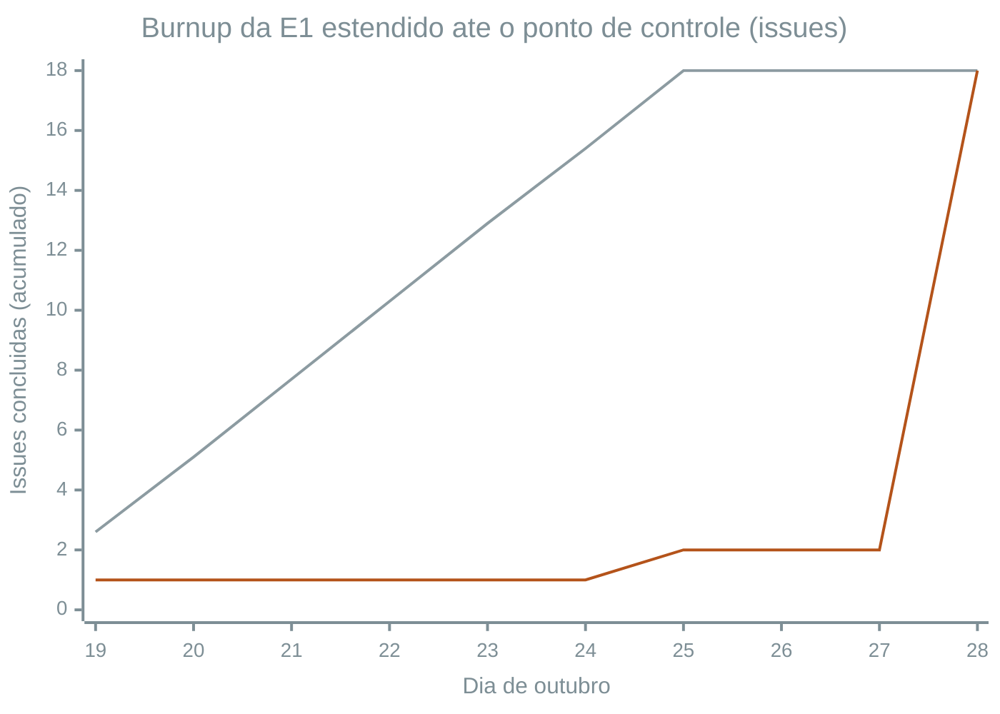
```mermaid
---
config:
  themeVariables:
    xyChart:
      plotColorPalette: "#8C9BA1, #B4531A"
      titleColor: "#7D8E95"
      xAxisLabelColor: "#7D8E95"
      xAxisTitleColor: "#7D8E95"
      xAxisLineColor: "#7D8E95"
      xAxisTickColor: "#7D8E95"
      yAxisLabelColor: "#7D8E95"
      yAxisTitleColor: "#7D8E95"
      yAxisLineColor: "#7D8E95"
      yAxisTickColor: "#7D8E95"
      backgroundColor: "transparent"
---
xychart-beta
    title "Burnup da E1 estendido ate o ponto de controle (issues)"
    x-axis "Dia de outubro" [19, 20, 21, 22, 23, 24, 25, 26, 27, 28]
    y-axis "Issues concluidas (acumulado)" 0 --> 18
    line [2.6, 5.1, 7.7, 10.3, 12.9, 15.4, 18, 18, 18, 18]
    line [1, 1, 1, 1, 1, 1, 2, 2, 2, 18]
```

_Figura 9 - Burnup da E1 estendido até 28/10: linha cinza = planejado, linha terracota = concluído. As 16 issues restantes foram declaradas concluídas em bloco no ponto de controle, três dias após o vencimento da milestone. Indicador CP1. Fonte: [`linha-de-base-e1.csv`](https://github.com/FCTE-Qualidade-de-Software-1/2026-2_T02_FRANCES_ALLEN/blob/main/dados/gestao/linha-de-base-e1.csv) e declaração do ponto de controle de 28/10._

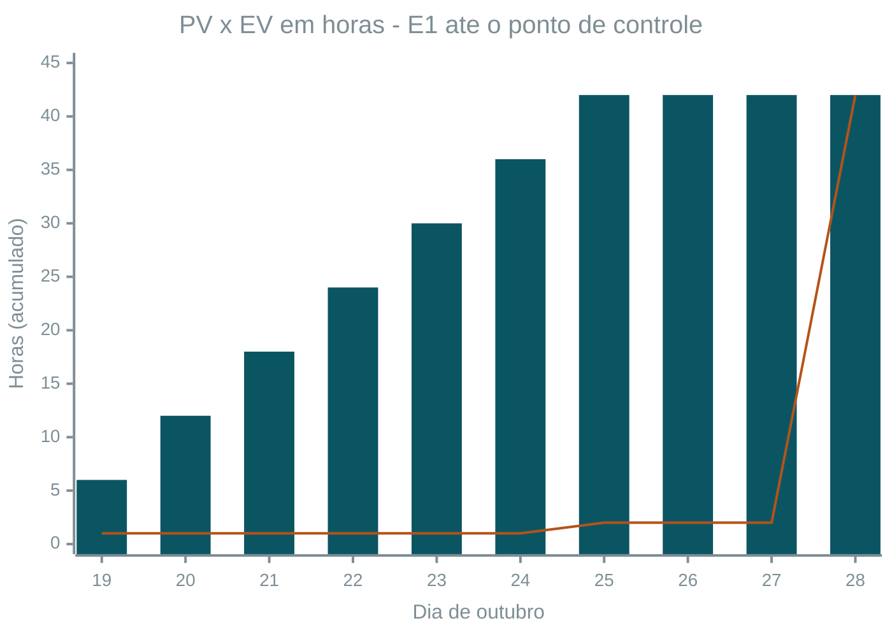
```mermaid
---
config:
  themeVariables:
    xyChart:
      plotColorPalette: "#0B5563, #B4531A"
      titleColor: "#7D8E95"
      xAxisLabelColor: "#7D8E95"
      xAxisTitleColor: "#7D8E95"
      xAxisLineColor: "#7D8E95"
      xAxisTickColor: "#7D8E95"
      yAxisLabelColor: "#7D8E95"
      yAxisTitleColor: "#7D8E95"
      yAxisLineColor: "#7D8E95"
      yAxisTickColor: "#7D8E95"
      backgroundColor: "transparent"
---
xychart-beta
    title "PV x EV em horas - E1 ate o ponto de controle"
    x-axis "Dia de outubro" [19, 20, 21, 22, 23, 24, 25, 26, 27, 28]
    y-axis "Horas (acumulado)" 0 --> 45
    bar [6, 12, 18, 24, 30, 36, 42, 42, 42, 42]
    line [1, 1, 1, 1, 1, 1, 2, 2, 2, 42]
```

_Figura 10 - Valor planejado (barras) e valor agregado (linha) da E1 até 28/10. O encontro das duas curvas no fim do período é o que faz o SPI ir de 0,05 a 1,00 sem que o atraso desapareça: ele passa a ser lido na variação de prazo em dias. Indicador CP2. Fonte: `linha-de-base-e1.csv`._

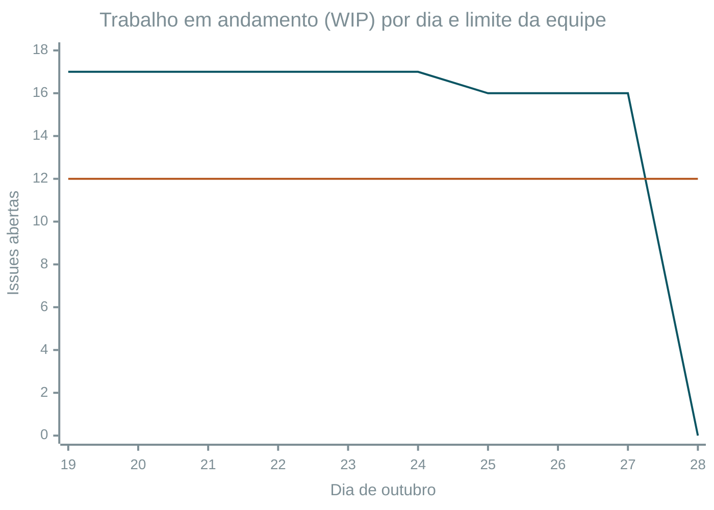
```mermaid
---
config:
  themeVariables:
    xyChart:
      plotColorPalette: "#0B5563, #B4531A"
      titleColor: "#7D8E95"
      xAxisLabelColor: "#7D8E95"
      xAxisTitleColor: "#7D8E95"
      xAxisLineColor: "#7D8E95"
      xAxisTickColor: "#7D8E95"
      yAxisLabelColor: "#7D8E95"
      yAxisTitleColor: "#7D8E95"
      yAxisLineColor: "#7D8E95"
      yAxisTickColor: "#7D8E95"
      backgroundColor: "transparent"
---
xychart-beta
    title "Trabalho em andamento (WIP) por dia e limite da equipe"
    x-axis "Dia de outubro" [19, 20, 21, 22, 23, 24, 25, 26, 27, 28]
    y-axis "Issues abertas" 0 --> 18
    line [17, 17, 17, 17, 17, 17, 16, 16, 16, 0]
    line [12, 12, 12, 12, 12, 12, 12, 12, 12, 12]
```

_Figura 11 - WIP diário (linha azul) contra o limite da equipe de 12 issues, ou 2 por integrante (linha terracota). O WIP ficou acima do limite por nove dias e caiu a zero de uma vez no ponto de controle. Indicador DP2. Fonte: issues da milestone E1 e declaração do ponto de controle._

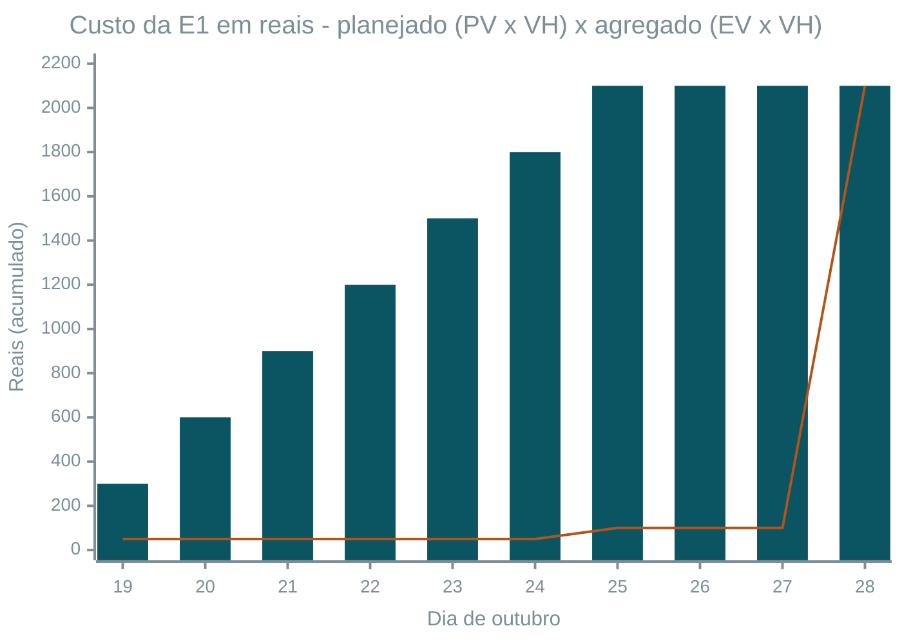
```mermaid
---
config:
  themeVariables:
    xyChart:
      plotColorPalette: "#0B5563, #B4531A"
      titleColor: "#7D8E95"
      xAxisLabelColor: "#7D8E95"
      xAxisTitleColor: "#7D8E95"
      xAxisLineColor: "#7D8E95"
      xAxisTickColor: "#7D8E95"
      yAxisLabelColor: "#7D8E95"
      yAxisTitleColor: "#7D8E95"
      yAxisLineColor: "#7D8E95"
      yAxisTickColor: "#7D8E95"
      backgroundColor: "transparent"
---
xychart-beta
    title "Custo da E1 em reais - planejado (PV x VH) x agregado (EV x VH)"
    x-axis "Dia de outubro" [19, 20, 21, 22, 23, 24, 25, 26, 27, 28]
    y-axis "Reais (acumulado)" 0 --> 2200
    bar [300, 600, 900, 1200, 1500, 1800, 2100, 2100, 2100, 2100]
    line [50, 50, 50, 50, 50, 50, 100, 100, 100, 2100]
```

_Figura 12 - A curva do CP2 convertida em reais pelo valor-hora de referência de R$50: barras = custo planejado (PV × VH) e linha = valor entregue (EV × VH). A E1 vale **R$2.100** de esforço planejado; no vencimento havia R$100 entregues e, no ponto de controle, os R$2.100 completos. **Isto não é o CPI:** o CPI exige o custo real (`AC` = horas reais × VH) e, com o `esforco.csv` vazio, não há `AC`, então o RC2 segue não mensurável. Fonte: `linha-de-base-e1.csv` e o VH de R$50 do [plano de medição](plano-de-medicao.md)._

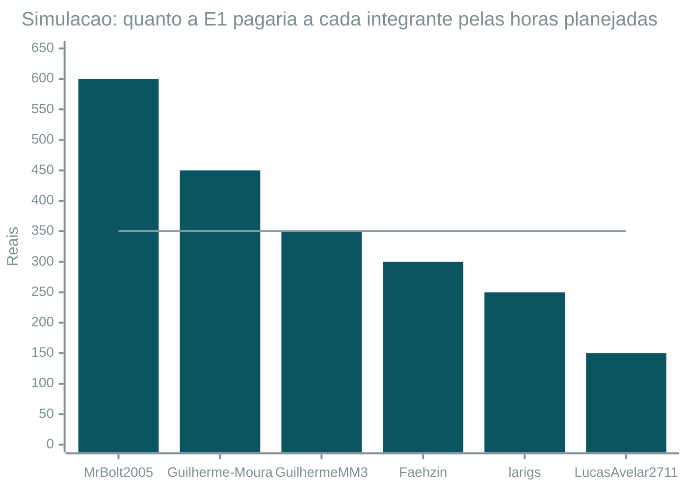
```mermaid
---
config:
  themeVariables:
    xyChart:
      plotColorPalette: "#0B5563, #8C9BA1"
      titleColor: "#7D8E95"
      xAxisLabelColor: "#7D8E95"
      xAxisTitleColor: "#7D8E95"
      xAxisLineColor: "#7D8E95"
      xAxisTickColor: "#7D8E95"
      yAxisLabelColor: "#7D8E95"
      yAxisTitleColor: "#7D8E95"
      yAxisLineColor: "#7D8E95"
      yAxisTickColor: "#7D8E95"
      backgroundColor: "transparent"
---
xychart-beta
    title "Simulacao: quanto a E1 pagaria a cada integrante pelas horas planejadas"
    x-axis ["MrBolt2005", "Guilherme-Moura", "GuilhermeMM3", "Faehzin", "larigs", "LucasAvelar2711"]
    y-axis "Reais" 0 --> 650
    bar [600, 450, 350, 300, 250, 150]
    line [350, 350, 350, 350, 350, 350]
```

_Figura 13 - Simulação de remuneração da E1 a R$50 por hora: MrBolt2005 R$600 (12 h), Guilherme-Moura R$450 (9 h), GuilhermeMM3 R$350 (7 h), Faehzin R$300 (6 h), larigs R$250 (5 h) e LucasAvelar2711 R$150 (3 h), de um total de R$2.100._

### 4.4 Leitura do ciclo e decisões disparadas

1. **O escopo foi salvo, o prazo não.** CP1 fechou em 100% e o SPI em 1,00, mas ambos só na data de corte: no vencimento o SPI era 0,05 e a entrega saiu com 1 a 3 dias de atraso. A D03 funcionou como ação de recuperação, não como ação de prazo.
2. **O risco mudou de lado.** No ciclo 1 o problema era trabalho que entrava e não saía (razão de 0,11, WIP de 2,7 por pessoa). Agora é o contrário: nenhuma chegada, WIP zero e nenhum backlog para o ciclo seguinte. Dispara a **D10**.
3. **As duas decisões de infraestrutura de medição não saíram do papel.** D05 (horas) com 0 de 6 e D06 (PR e rastreabilidade) com 0 PRs e 0 `Closes #N`. Enquanto isso, três das dez métricas do plano (RC1, RC2 e o RC3 por horas reais) seguem não mensuráveis e os números de CP1 e CP2 dependem de declaração, não de registro. É o achado mais grave desta coleta.
4. **A causa comum é de comunicação, não de esforço.** O ponto de controle correu fora de sala, por falta de tempo em aula, e com resposta parcial da equipe. Dispara a **D09**.
5. **O remanejamento das divisões invalida a base de atribuição da E1.** A carga planejada por integrante (de 7,1% a 28,6%) não serve mais para julgar contribuição individual. Dispara a **D08**, que absorve a D07.

## 5. Ciclo 2 (fechamento retroativo): 26/10 a 01/11

A coleta completa de 01/11 não foi feita no dia. Ela foi fechada em 13/11 com os mesmos dados que ela teria: o `git log` e a API do GitHub, que guardam data e hora de cada evento. Nada mudou no repositório entre 29/10 e 01/11, então os valores da coleta parcial de 28/10 viram os valores finais do ciclo, e esta seção registra só o que ficou para domingo.

| Métrica | Valor | Limite | Situação | Interpretação |
|---------|-------|--------|:--------:|---------------|
| DP1 *Lead time* | 16 issues declaradas concluídas em 28/10: **9,3 dias** da abertura (19/10, 14h35) à declaração. No GitHub, nenhuma issue foi fechada no ciclo | ≤ 3 dias | (AN) | Como a data é a do ponto de controle, e não a da conclusão real, 9,3 dias é um limite superior. Mesmo assim fica três vezes acima da faixa |
| DP3 Índice de pico | 2 de 3 commits em 28/10 = **66,7%**. 2 dias ativos em 7 (26 e 28/10). Nenhum commit de 29/10 a 01/11 | ≤ 40% | (AN) | O ciclo terminou com quatro dias sem atividade no repositório, o que antecipa o ciclo 3 sem backlog (D10) |
| DP4 Retrabalho | 2 de 3 commits = **66,7%**. Nenhum PR | ≤ 20% | (AN) | Os três commits do ciclo são de documentação e correção. Sem PR, o DP4 por PR segue sem base de cálculo |
| RC3 Contribuição individual (*proxy*: commits) | larigs 2 (**66,7%**) · Guilherme-Moura 1 (**33,3%**) · demais 0 | 13% a 20% | (AN) | Com três commits, o *proxy* não diz nada sobre a equipe. O trabalho do ciclo foi o artigo, que está no Overleaf e não aparece no repositório |
| RC1 / RC2 | Nenhuma hora registrada com data no ciclo | - | (--) | O `esforco.csv` continuava vazio em 01/11 |

## 6. Ciclo 3 (retroativo): 02/11 a 08/11

### 6.1 Contexto

| Item | Registro |
|------|----------|
| Abertura da E2 | Em **04/11 (quarta-feira), às 14h26**, foram criadas as milestones "E2 - Ponto de controle (Fase 3)", com vencimento em 15/11 às 21h, e "E2 - Entrega final (Fase 4 e artigo v2)", com vencimento em 21/11 às 21h. No mesmo minuto foram abertas as 12 issues #20 a #31, cada uma com responsável e rótulo, duas por integrante. A #14, pendente da E1, foi movida para a milestone da Fase 3 e fechada |
| Regularização da E1 | Também em 04/11, entre 14h19 e 14h26, as 15 issues da E1 que estavam abertas foram fechadas no GitHub. A milestone **E1 continua aberta**, com 0 issues abertas e 17 fechadas |
| Linha de base da E2 | As issues foram abertas **sem horas estimadas**, e as datas de fim planejadas estão só no [cronograma da avaliação](../fase-3/cronograma.md). A estimativa foi feita pelo gerente de medição **em 13/11, depois do início da E2**: 2 h para cada issue da Fase 3 (#14 e #20 a #25, 14 h) e de 3 h a 5 h para as da Fase 4, conforme o trabalho de preparar o formulário, as questões e a medição (#26, #27 e #28 com 5 h; #29 e #31 com 4 h; #30 com 3 h; 26 h). Total da E2: **40 h**, ou **R$2.000**. Está em [`linha-de-base-e2.csv`](https://github.com/FCTE-Qualidade-de-Software-1/2026-2_T02_FRANCES_ALLEN/blob/main/dados/gestao/linha-de-base-e2.csv). Por ser posterior, a estimativa vale para calcular CP2, RC1 e RC2, mas não serviu para planejar os ciclos 3 e 4 |
| PR | O PR [#32](https://github.com/FCTE-Qualidade-de-Software-1/2026-2_T02_FRANCES_ALLEN/pull/32) (Fase 3 e correções da E1) foi aberto em 04/11 com `Refs #25` e pedido de revisão por dono de página. É o primeiro PR desde o #1 |

### 6.2 Medições

| Métrica | Valor | Limite | Situação | Interpretação |
|---------|-------|--------|:--------:|---------------|
| CP1 Comprometido x concluído | Milestone "E2 - Ponto de controle": `I_comp` = 7 (#14 e #20 a #25), `I_conc` = 1 (#14) = **14,3%**. Em 08/11, 23h59, tinham passado **39,0%** do período da milestone (de 04/11, 14h26, a 15/11, 21h): **desvio de 24,7 p.p.** | ≤ 5 p.p. | (AN) | A única issue fechada é uma sobra da E1. Nenhum dos seis métodos da Fase 3 foi entregue no ciclo |
| CP2 SPI | Milestone "E2 - Ponto de controle": 14 h estimadas. Em 08/11, 23h59, `PV` = 39,0% × 14 h = **5,5 h** · `EV` = 2 h (#14) · **SPI = 0,37** | ≥ 0,90 | (AN) | Pela estimativa retroativa, o ciclo entregou pouco mais de um terço do valor planejado. A única issue fechada é uma sobra da E1 |
| RC1 / RC2 | 2 h registradas com data no ciclo (Faehzin, PSM). `AC` = 2 h = **R$100**. A issue fechada (#14) não tem horas registradas | - | (--) | O trabalho com horas registradas (PSM) não tem issue, e a issue fechada não tem horas, então não há par estimado x real nem CPI com significado |
| RC3 (*proxy*: commits) | Faehzin 2 (**50%**) · LucasAvelar2711 2 (**50%**) · demais 0 | 13% a 20% | (AN) | Dois integrantes concentraram todo o trabalho no repositório |
| RC3 (*proxy*: linhas) | Faehzin 431 (**59,6%**) · LucasAvelar2711 292 (**40,4%**) · demais 0 | 13% a 20% | (AN) | Mesma leitura do *proxy* de commits |
| RC3 (carga planejada da E2) | 38 h estimadas nas issues #20 a #31: Faehzin, larigs e MrBolt2005 com 7 h (**18,4%** cada) · Guilherme-Moura e LucasAvelar2711 com 6 h (**15,8%**) · GuilhermeMM3 com 5 h (**13,2%**) | 13% a 20% | (OK) | Primeira distribuição planejada dentro da faixa para os seis integrantes. A #14, sobra da E1 com 2 h, fica de fora |
| DP1 *Lead time* | 16 issues fechadas no GitHub em 04/11 (15 da E1 e a #14): **16,0 dias** de média. Pela data declarada (28/10), 9,3 dias. Abertas em 08/11: 12, com idade média de **4,4 dias** | ≤ 3 dias | (AN) | Os 16,0 dias medem a demora para registrar o fechamento, não para fazer o trabalho. A diferença de 6,7 dias entre o declarado e o registrado é o custo da falha de rastreabilidade da D06 |
| DP2 Razão saída/chegada | **12 chegadas** (#20 a #31) e **16 saídas**: razão **1,33** | ≥ 0,90 | (OK) | Pela regra, OK. Na prática, as 16 saídas são o registro de trabalho declarado no ciclo 2: nenhuma entrega nova do ciclo 3 virou issue fechada. Sem as regularizações, a razão seria 0 de 12 |
| DP2 WIP | **12 issues abertas** em 08/11, **2,0 por integrante** | ≤ 2 por integrante | (OK) | No limite da D04. Metade do WIP são issues da Fase 4, que só começam em 13/11 |
| DP3 Índice de pico | 4 de 4 commits em 04/11 = **100%**. **1 dia ativo em 7** | ≤ 40% | (AN) | Repete o padrão dos ciclos 0 e 1: todo o trabalho do ciclo entrou em uma tarde, no mesmo intervalo de 6 minutos (14h33 a 14h39) |
| DP4 Retrabalho | 2 de 4 commits = **50%**: [`bacaa08`](https://github.com/FCTE-Qualidade-de-Software-1/2026-2_T02_FRANCES_ALLEN/commit/bacaa08) (correções da E1) e [`3dd61ca`](https://github.com/FCTE-Qualidade-de-Software-1/2026-2_T02_FRANCES_ALLEN/commit/3dd61ca) (gráficos do PSM corrigidos) | ≤ 20% | (AN) | Um dos retrabalhos é esperado (as correções pedidas na avaliação da E1). O outro corrige um commit de 6 minutos antes |
| Rastreabilidade | 0 de 4 commits com `Closes #N`. 1 PR aberto (#32), ligado à #25 por `Refs` | 100% dos PRs ligados a issue e revisados | (A) | Primeiro uso do fluxo de PR da D06 |

### 6.3 Gráficos

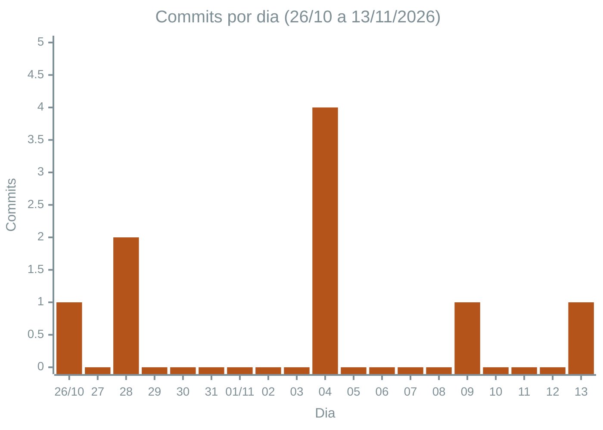
```mermaid
---
config:
  themeVariables:
    xyChart:
      plotColorPalette: "#B4531A"
      titleColor: "#7D8E95"
      xAxisLabelColor: "#7D8E95"
      xAxisTitleColor: "#7D8E95"
      xAxisLineColor: "#7D8E95"
      xAxisTickColor: "#7D8E95"
      yAxisLabelColor: "#7D8E95"
      yAxisTitleColor: "#7D8E95"
      yAxisLineColor: "#7D8E95"
      yAxisTickColor: "#7D8E95"
      backgroundColor: "transparent"
---
xychart-beta
    title "Commits por dia (26/10 a 13/11/2026)"
    x-axis "Dia" ["26/10", "27", "28", "29", "30", "31", "01/11", "02", "03", "04", "05", "06", "07", "08", "09", "10", "11", "12", "13"]
    y-axis "Commits" 0 --> 5
    bar [1, 0, 2, 0, 0, 0, 0, 0, 0, 4, 0, 0, 0, 0, 1, 0, 0, 0, 1]
```

_Figura 14 - Commits por dia nos ciclos 2, 3 e 4, sem os commits de merge (9 commits). Em 19 dias, só 5 tiveram commit, e 04/11 sozinho concentra 4. O merge do PR #32, em 11/11, não aparece porque não traz conteúdo novo. Indicador DP3. Fonte: [`commits.csv`](https://github.com/FCTE-Qualidade-de-Software-1/2026-2_T02_FRANCES_ALLEN/blob/main/dados/gestao/commits.csv)._

## 7. Ciclo 4 (parcial): 09/11 a 13/11

### 7.1 Contexto

| Item | Registro |
|------|----------|
| Data de corte | 13/11/2026, 21h46, quando a #21 foi fechada no GitHub |
| #21 (método do G2 por inspeção) | Fechada no GitHub em 13/11, às 21h46. A conclusão foi **declarada pelo responsável como 10/11** (terça-feira); só faltava o registro de horas. A coleta usa 10/11 para CP1, CP2 e DP1, e o fechamento no GitHub aparece como data registrada |
| PR #32 | Integrado em 11/11, às 12h32, **sem nenhuma revisão registrada**, depois de 6,9 dias aberto. A descrição pedia revisão de três donos de página e o OK do Guilherme Moura para uma mudança de decisão da Fase 1 |
| Commits fora de PR | [`e642ffb`](https://github.com/FCTE-Qualidade-de-Software-1/2026-2_T02_FRANCES_ALLEN/commit/e642ffb) (13/11) entrou direto no `main`, sem PR e sem `Closes #21` |
| Horas | Primeiro registro no `esforco.csv`, em 13/11: 4 linhas e 11 h, todas de Faehzin, sendo 3 h da #21 neste ciclo |

### 7.2 Medições

| Métrica | Valor | Limite | Situação | Interpretação |
|---------|-------|--------|:--------:|---------------|
| CP1 Comprometido x concluído | Milestone "E2 - Ponto de controle": `I_conc` = 2 (#14 e #21) de 7 = **28,6%**. Na data de corte já tinham passado **82,5%** do período: **desvio de 54,0 p.p.** Na quarta-feira, 11/11, às 21h, o desvio era de 35,9 p.p. (28,6% contra 64,5%) | ≤ 5 p.p. | (AN) | O desvio cresceu de 24,7 para 54,0 p.p. em cinco dias. Faltando 2 dias para o vencimento, 5 das 7 issues estão abertas. Sem contar a #14, que é da E1, a Fase 3 tem 1 de 6 issues fechadas (16,7%) |
| CP2 SPI (hora/valor) | Milestone "E2 - Ponto de controle": `PV` = 82,5% × 14 h = **11,6 h** · `EV` = 4 h (#14 e #21) · **SPI = 0,35**. Em 11/11, às 21h, era 0,44 (`PV` = 9,0 h) | ≥ 0,90 | (AN) | Um terço do valor planejado foi entregue com 82,5% do prazo. Como toda issue da Fase 3 vale 2 h, o SPI em horas acompanha o CP1 |
| CP2 SPI por contagem (*proxy*) | Pelo [cronograma](../fase-3/cronograma.md), 5 issues deviam estar prontas até 13/11 (#20 a #23 em 12/11 e #24 em 13/11). Fechada: 1 (#21). **SPI = 1 / 5 = 0,20** | ≥ 0,90 | (AN) | Usa as datas de fim do cronograma em vez da distribuição linear da milestone. Os métodos #20, #22 e #23 têm rascunho no `main` desde 09/11, o que indica trabalho feito e não fechado |
| CP2 Variação de prazo | #20, #22 e #23: **1 dia** após o fim planejado (12/11). #24 no dia do fim planejado | - | (A) | O prazo interno da Fase 3 (14/11) ainda não venceu. O ponto de controle da disciplina é em 16/11 |
| RC1 Variação de esforço | #21 (Faehzin): `H_real` = 3 h, `H_est` = 2 h, **TVE = +50%** | -20% a +20% | (AN) | O método levou 1 h a mais que o estimado, mas a estimativa de 2 h foi feita depois da entrega. Para a equipe, o RC1 continua não mensurável: o gerente de medição não tem como obter as horas dos outros cinco integrantes (ver D12) |
| RC2 CPI | Entregas do ciclo: `EV` = 2 h (#21) · `AC` = 3 h = **R$150** · **CPI = 0,67** | ≥ 0,90 | (AN) | Cada hora gasta entregou 40 min de valor planejado. O CPI vale só para a #21: as horas de quem trabalhou sem fechar issue não estão no `AC`. Total registrado até a data de corte: **11 h = R$550**, todo de um integrante |
| RC3 (*proxy*: commits) | Faehzin 2 de 2 = **100%** | 13% a 20% | (AN) | O `e642ffb` soma 1.419 linhas, a maioria de modelos de fichas gerados com apoio de IA (declarado em [Uso de IA](../sobre/uso-de-ia.md)), o que distorce ainda mais o *proxy* de linhas. Por isso esta coleta não usa linhas no ciclo 4 |
| DP1 *Lead time* | #21: cerca de **6 dias** (de 04/11, 14h26, a 10/11, data declarada). No GitHub, 9,3 dias. Abertas: 11, com idade média de **9,3 dias** | ≤ 3 dias | (AN) | A #21 cobre um método inteiro; pela D04 ela deveria estar dividida em partes de até 1 dia. As abertas incluem as 6 issues da Fase 4, abertas com antecedência de propósito (D10), que pesam na idade sem estarem atrasadas |
| DP2 Razão saída/chegada | **0 chegadas** e **1 saída** (#21): razão indefinida | ≥ 0,90 | (A) | O backlog já estava aberto desde 04/11, então zero chegadas é esperado. O problema é a saída: 1 issue em 5 dias |
| DP2 WIP | **11 abertas**, **1,8 por integrante** (Faehzin 1; os outros cinco com 2) | ≤ 2 por integrante | (OK) | Dentro do limite |
| DP3 Índice de pico | 1 de 2 commits no dia de maior atividade = **50%**. 2 dias ativos em 5 (09 e 13/11) | ≤ 40% | (A) | Melhor que os ciclos anteriores, mas com só dois commits o índice tem pouca informação |
| DP4 Retrabalho | Por commit: 0 de 2 = **0%**. O `e642ffb` mistura correções do método (50 linhas incluídas e 38 removidas) e conteúdo novo (fichas e página da Fase 4) e foi classificado como novo pelo que predomina. Por PR: 1 PR integrado (#32), 0 pedidos de ajuste, **0 revisões** | ≤ 20% | (OK) | O DP4 por PR dá 0%, mas só porque ninguém revisou. Um PR sem revisão não tem como receber pedido de ajuste, então esse 0% não indica qualidade |
| Rastreabilidade | 0 de 2 commits com `Closes #N`. 1 PR integrado sem revisão. A #21 foi fechada à mão, 3 dias depois da conclusão declarada | 100% | (AN) | O fluxo de PR da D06 foi usado uma vez, mas sem a etapa que dá sentido a ele: a revisão |

### 7.3 Gráficos

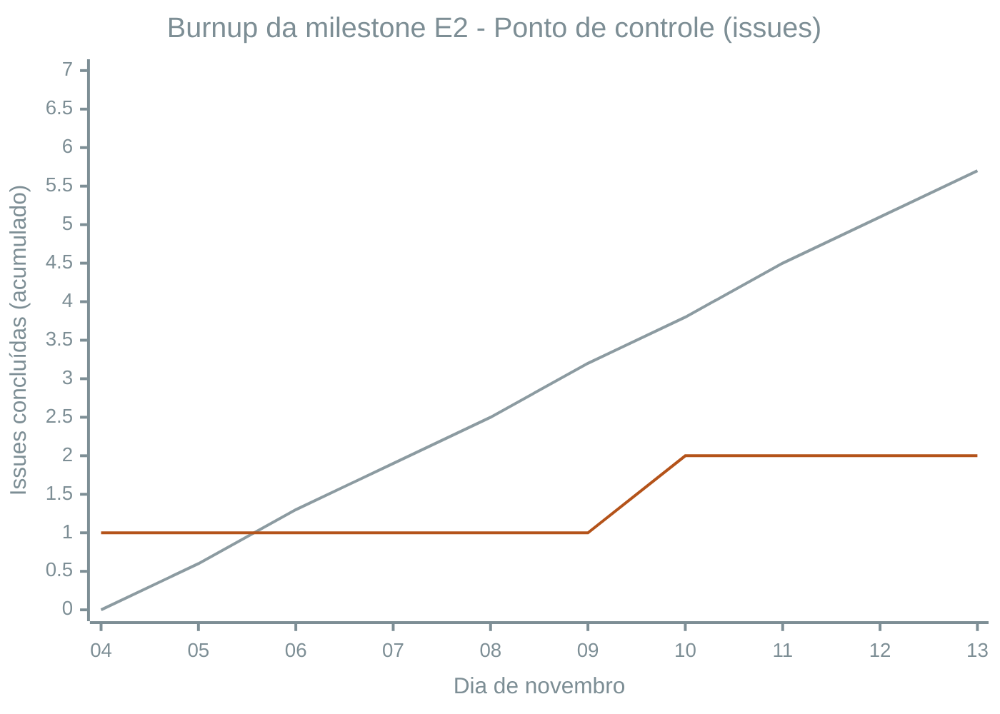
```mermaid
---
config:
  themeVariables:
    xyChart:
      plotColorPalette: "#8C9BA1, #B4531A"
      titleColor: "#7D8E95"
      xAxisLabelColor: "#7D8E95"
      xAxisTitleColor: "#7D8E95"
      xAxisLineColor: "#7D8E95"
      xAxisTickColor: "#7D8E95"
      yAxisLabelColor: "#7D8E95"
      yAxisTitleColor: "#7D8E95"
      yAxisLineColor: "#7D8E95"
      yAxisTickColor: "#7D8E95"
      backgroundColor: "transparent"
---
xychart-beta
    title "Burnup da milestone E2 - Ponto de controle (issues)"
    x-axis "Dia de novembro" [04, 05, 06, 07, 08, 09, 10, 11, 12, 13]
    y-axis "Issues concluídas (acumulado)" 0 --> 7
    line [0, 0.6, 1.3, 1.9, 2.5, 3.2, 3.8, 4.5, 5.1, 5.7]
    line [1, 1, 1, 1, 1, 1, 2, 2, 2, 2]
```

_Figura 15 - Burnup da milestone "E2 - Ponto de controle (Fase 3)" até a data de corte: linha cinza = planejado (7 issues distribuídas de forma linear até o vencimento, em 15/11) e linha terracota = concluído (#14 em 04/11 e #21 em 10/11, data declarada). Indicador CP1. Fonte: API de issues do GitHub e [`linha-de-base-e2.csv`](https://github.com/FCTE-Qualidade-de-Software-1/2026-2_T02_FRANCES_ALLEN/blob/main/dados/gestao/linha-de-base-e2.csv)._

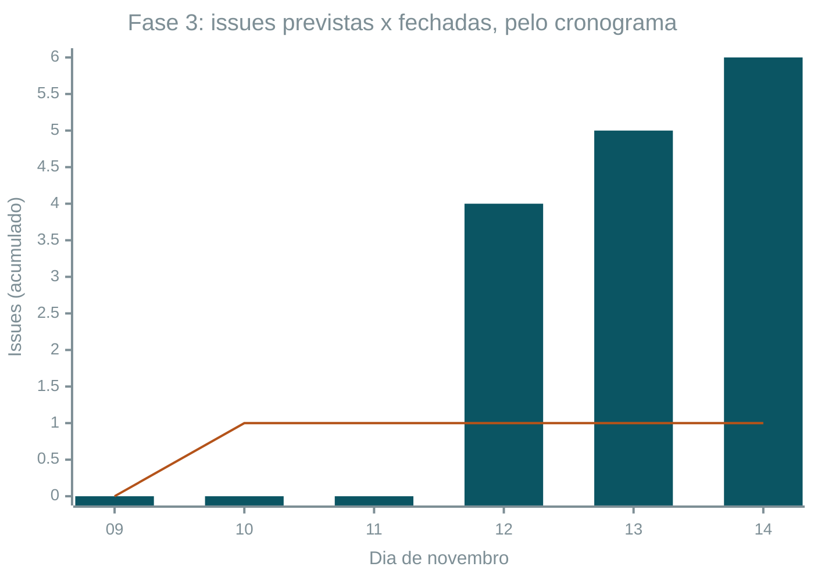
```mermaid
---
config:
  themeVariables:
    xyChart:
      plotColorPalette: "#0B5563, #B4531A"
      titleColor: "#7D8E95"
      xAxisLabelColor: "#7D8E95"
      xAxisTitleColor: "#7D8E95"
      xAxisLineColor: "#7D8E95"
      xAxisTickColor: "#7D8E95"
      yAxisLabelColor: "#7D8E95"
      yAxisTitleColor: "#7D8E95"
      yAxisLineColor: "#7D8E95"
      yAxisTickColor: "#7D8E95"
      backgroundColor: "transparent"
---
xychart-beta
    title "Fase 3: issues previstas x fechadas, pelo cronograma"
    x-axis "Dia de novembro" [09, 10, 11, 12, 13, 14]
    y-axis "Issues (acumulado)" 0 --> 6
    bar [0, 0, 0, 4, 5, 6]
    line [0, 1, 1, 1, 1, 1]
```

_Figura 16 - SPI por contagem das issues da Fase 3 (#20 a #25): barras = issues com fim planejado até o dia, pelo cronograma; linha = issues fechadas. Em 13/11, 5 previstas e 1 fechada (SPI = 0,20). A barra de 14/11 é o prazo interno da Fase 3. Indicador CP2 (*proxy*). Fonte: [cronograma da avaliação](../fase-3/cronograma.md) e API de issues do GitHub._

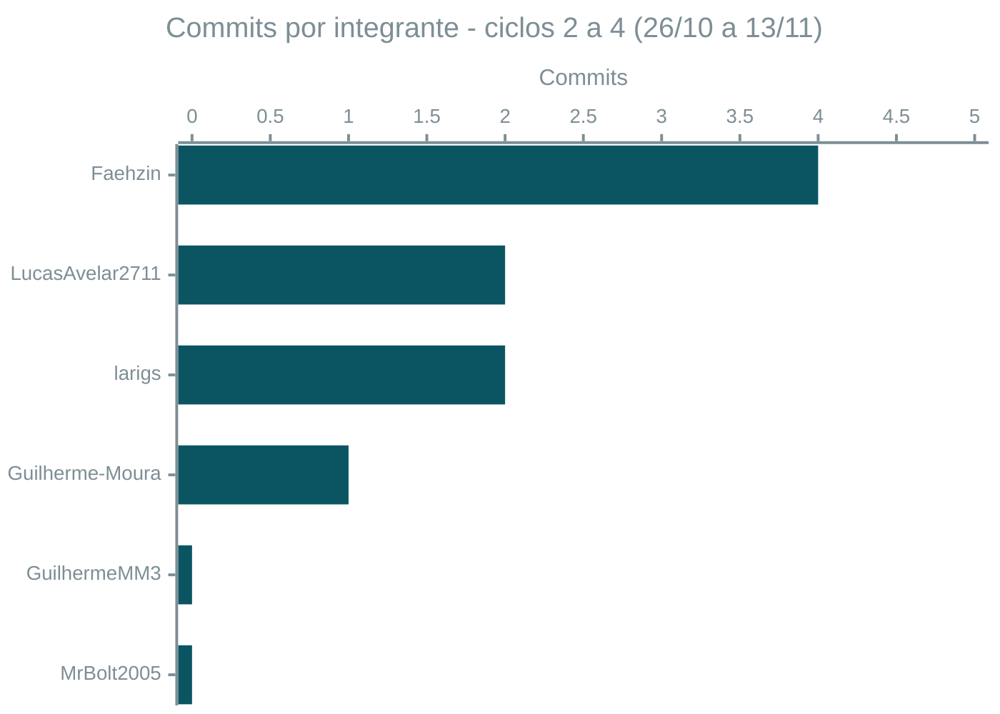
```mermaid
---
config:
  themeVariables:
    xyChart:
      plotColorPalette: "#0B5563"
      titleColor: "#7D8E95"
      xAxisLabelColor: "#7D8E95"
      xAxisTitleColor: "#7D8E95"
      xAxisLineColor: "#7D8E95"
      xAxisTickColor: "#7D8E95"
      yAxisLabelColor: "#7D8E95"
      yAxisTitleColor: "#7D8E95"
      yAxisLineColor: "#7D8E95"
      yAxisTickColor: "#7D8E95"
      backgroundColor: "transparent"
---
xychart-beta horizontal
    title "Commits por integrante - ciclos 2 a 4 (26/10 a 13/11)"
    x-axis ["Faehzin", "LucasAvelar2711", "larigs", "Guilherme-Moura", "GuilhermeMM3", "MrBolt2005"]
    y-axis "Commits" 0 --> 5
    bar [4, 2, 2, 1, 0, 0]
```

_Figura 17 - Commits por integrante desde o fim da E1, sem os de merge (9 commits): Faehzin 44,4%, LucasAvelar2711 22,2%, larigs 22,2%, Guilherme-Moura 11,1%, GuilhermeMM3 e MrBolt2005 0%. É o *proxy* do RC3 enquanto só 1 de 6 integrantes registra horas, com a mesma ressalva dos ciclos anteriores: o trabalho fora do repositório (Overleaf e rascunhos locais) não aparece. Fonte: [`commits.csv`](https://github.com/FCTE-Qualidade-de-Software-1/2026-2_T02_FRANCES_ALLEN/blob/main/dados/gestao/commits.csv)._

### 7.4 Leitura dos ciclos 2 a 4 e decisões disparadas

1. **O backlog voltou, a entrega não.** A D10 trouxe a E2 para o GitHub em 04/11, com milestones e duas issues por integrante, e CP1, DP1 e DP2 voltaram a ser mensuráveis. Mas, das 6 issues de método da Fase 3, só 1 fechou até 13/11. O desvio do CP1 foi a 54,0 p.p., e o SPI por contagem ficou em 0,20 a dois dias do vencimento. O SPI em horas é 0,35. Dispara a **D11**.
2. **A rajada continua.** O ciclo 3 teve 100% dos commits em uma tarde, e nos três ciclos houve 5 dias ativos em 19. O ciclo 4 parcial é o primeiro abaixo de 60% de pico, mas com só 2 commits.
3. **As horas começaram a entrar, por uma pessoa só.** O `esforco.csv` saiu do zero em 13/11 com 11 h, todas de um integrante, e a E2 ganhou estimativa (40 h) em 13/11. Com isso, RC1 e RC2 foram calculados pela primeira vez (TVE de +50% e CPI de 0,67), mas só para a #21. As horas dos outros cinco integrantes não podem ser obtidas pelo gerente de medição, então RC1 e RC2 da equipe ficam fora do alcance desta medição. Dispara a **D12**.
4. **O PR foi usado, a revisão não.** O #32 é o primeiro PR desde o #1 e foi integrado sem nenhuma revisão, apesar do pedido na descrição. O DP4 por PR dá 0%, mas esse número só mostra que não houve revisão.
5. **O fechamento continua sendo declarado.** A E1 foi registrada no GitHub 6,7 dias depois da conclusão declarada, e a #21, 3 dias depois. Enquanto o fechamento não sair do PR (`Closes #N`), CP1 e DP1 dependem de declaração.

## 8. Ciclo 4 (fechamento retroativo): 14/11 e 15/11

A coleta completa de domingo, 15/11, não foi feita no dia. Ela foi fechada em 19/11, como a do ciclo 2, com o `git log` e a API do GitHub, que guardam data e hora de cada evento. Data de corte: **15/11/2026, 23h59**. Os valores abaixo substituem os da coleta parcial de 13/11 (seção 7) no painel.

### 8.1 Contexto

| Item | Registro |
|------|----------|
| PR #33 | Aberto por LucasAvelar2711 em 14/11, às 21h54, com os métodos do G1, do G2 com usuários e do G3, recursos, consistência e cronograma. Integrado em 15/11, às 19h54, **1h06 antes do vencimento** da milestone "E2 - Ponto de controle" (15/11, 21h). É o **primeiro PR com `Closes`**: o merge fechou sozinho as #20, #22, #23 e #24 |
| Autoria pela D12 | As páginas das #20, #22, #23 e #24 foram escritas por LucasAvelar2711, que assumiu o trabalho pela [D12](decisoes.md#d12-redistribuir-o-trabalho-nao-entregue); os donos originais revisaram ([cronograma](../fase-3/cronograma.md), Tabela 2) |
| Revisão | **Nenhuma revisão formal no GitHub.** A larigs registrou a revisão do método do G1 em comentário no PR (14/11, 23h35) e subiu os ajustes num commit no branch do PR ([`31438fb`](https://github.com/FCTE-Qualidade-de-Software-1/2026-2_T02_FRANCES_ALLEN/commit/31438fb)); as revisões dela e do João foram propagadas às outras páginas em [`b7dba8c`](https://github.com/FCTE-Qualidade-de-Software-1/2026-2_T02_FRANCES_ALLEN/commit/b7dba8c) (15/11) |
| #25 | Continua aberta (cronograma, página da Fase 3 e correções da E1). É a única issue da milestone sem fechamento |
| Horas | A larigs registrou 4 h na #20 (revisão do método do G1, 14/11): segunda integrante com horas no `esforco.csv`. LucasAvelar2711, que escreveu quatro métodos, não tem horas registradas |

### 8.2 Medições

| Métrica | Valor | Limite | Situação | Interpretação |
|---------|-------|--------|:--------:|---------------|
| CP1 Comprometido x concluído | Milestone "E2 - Ponto de controle": `I_conc` = 6 (#14 e #20 a #24) de `I_comp` = 7 = **85,7%**, com 100% do período decorrido: **desvio de 14,3 p.p.** | ≤ 5 p.p. | (AN) | O desvio caiu de 54,0 p.p. (13/11) para 14,3 p.p. no vencimento: cinco métodos da Fase 3 fecharam até 15/11, quatro de uma vez pelo PR #33. Só a #25 ficou aberta |
| CP2 SPI (hora/valor) | `PV` = 14 h (100%) · `EV` = 12 h · **SPI = 0,86** | ≥ 0,90 | (A) | Melhor SPI da E2 e o primeiro sem efeito de saturação: o valor foi entregue antes do vencimento. Falta a #25 (2 h) |
| CP2 SPI por contagem | Pelo [cronograma](../fase-3/cronograma.md), 6 issues da Fase 3 (#20 a #25) com fim até 15/11; 5 fechadas: **SPI = 0,83** | ≥ 0,90 | (A) | Mesma leitura do SPI em horas |
| CP2 Variação de prazo | #20, #22 e #23: **3 dias** após o fim planejado (12/11). #24: **2 dias** (13/11). #25: aberta | - | (A) | As quatro fecharam dentro do vencimento da milestone, mas depois das datas do cronograma |
| RC1 Variação de esforço | #20 (larigs): `H_real` = 4 h, `H_est` = 2 h, **TVE = +100%** · #21 (Faehzin): **+50%** | -20% a +20% | (AN) | As duas issues com horas estouraram a estimativa. As 4 h da #20 são de revisão; a escrita, feita por LucasAvelar2711, não tem horas, então o custo real da #20 é maior. As #22 a #24 não têm horas |
| RC2 CPI | Issues fechadas com horas (#20 e #21): `EV` = 4 h · `AC` = 7 h = **R$350** · **CPI = 0,57** | ≥ 0,90 | (AN) | Cada hora registrada entregou 34 min de valor planejado. O CPI da equipe continua fora de alcance (D12) |
| RC3 (*proxy*: commits) | LucasAvelar2711 13 (**76,5%**) · Faehzin 3 (**17,6%**) · larigs 1 (**5,9%**) · demais 0 | 13% a 20% | (AN) | Efeito direto da D12: um integrante escreveu quatro métodos. É a redistribuição funcionando, mas o trabalho registrado continua concentrado |
| RC3 (horas registradas) | larigs 4 h (**57,1%**) · Faehzin 3 h (**42,9%**) · demais 0 | 13% a 20% | (AN) | Só 2 de 6 integrantes registram horas |
| DP1 *Lead time* | 5 fechadas no ciclo: #21 com 9,3 dias e #20, #22, #23 e #24 com 11,2 dias cada: média de **10,8 dias** (10,2 com a data declarada da #21). Abertas em 15/11: 7, com idade média de **11,4 dias** | ≤ 3 dias | (AN) | Cada issue de método ocupou o prazo inteiro da milestone. Pela D04, deveriam estar divididas em partes de até 1 dia |
| DP2 Razão saída/chegada | **0 chegadas** e **5 saídas**: razão indefinida | ≥ 0,90 | (A) | Melhor vazão da E2: 5 saídas no ciclo, contra 1 na coleta parcial |
| DP2 WIP | **7 abertas** em 15/11 (#25 a #31), **1,2 por integrante** | ≤ 2 por integrante | (OK) | Dentro do limite |
| DP3 Índice de pico | 13 de 17 commits em 14/11 = **76,5%**. 4 dias ativos em 7 (09, 13, 14 e 15/11) | ≤ 40% | (AN) | Os 13 commits de 14/11 entraram entre 21h06 e 23h13, na véspera do vencimento: a rajada dos ciclos 0 e 1 se repetiu |
| DP4 Retrabalho | Por commit: 9 de 17 = **52,9%**: oito de LucasAvelar2711 (coerência entre métodos, revisões de referência, caminhos normalizados, ida e volta na declaração de IA e propagação das revisões) e a revisão da larigs. Por PR: 2 integrados no ciclo (#32 e #33), **0 revisões formais**; o #33 teve revisão em comentário e 1 commit de ajuste | ≤ 20% | (AN) | Boa parte do retrabalho é a revisão cruzada de 15/11 feita dentro do PR, que é o uso esperado do fluxo. O número alto vem de a revisão acontecer na véspera, e não ao longo do ciclo |
| Rastreabilidade | 4 issues fechadas por `Closes` no PR #33; a #21 foi fechada à mão. 0 commits com `Closes #N` (o vínculo está no PR) | 100% dos PRs ligados a issue e revisados | (A) | **Primeira vez** que o fechamento sai do PR, como pediam a D06 e a D11. Falta a revisão formal |

### 8.3 Verificação da D11

| Item da [D11](decisoes.md#d11-recuperar-os-metodos-da-fase-3-antes-do-ponto-de-controle) | Resultado |
|------|-----------|
| (1) Um PR por responsável, com `Closes #N`, até 14/11 | Feito de forma coletiva: **um PR (#33)** para as #20, #22, #23 e #24, aberto em 14/11, às 21h54, por quem escreveu as páginas (D12) |
| (2) Revisão cruzada no PR, antes do merge | **Parcial**: revisão da larigs em comentário e commit no PR; revisões do João levadas por fora (`b7dba8c`). Nenhuma revisão formal do GitHub |
| (3) O que não fechou vira issue menor, de até 1 dia | **Não feito**: a #25 continua aberta e inteira |
| (4) Horas registradas ao fechar | **1 de 4** issues fechadas pelo PR com horas (#20) |

### 8.4 Gráfico

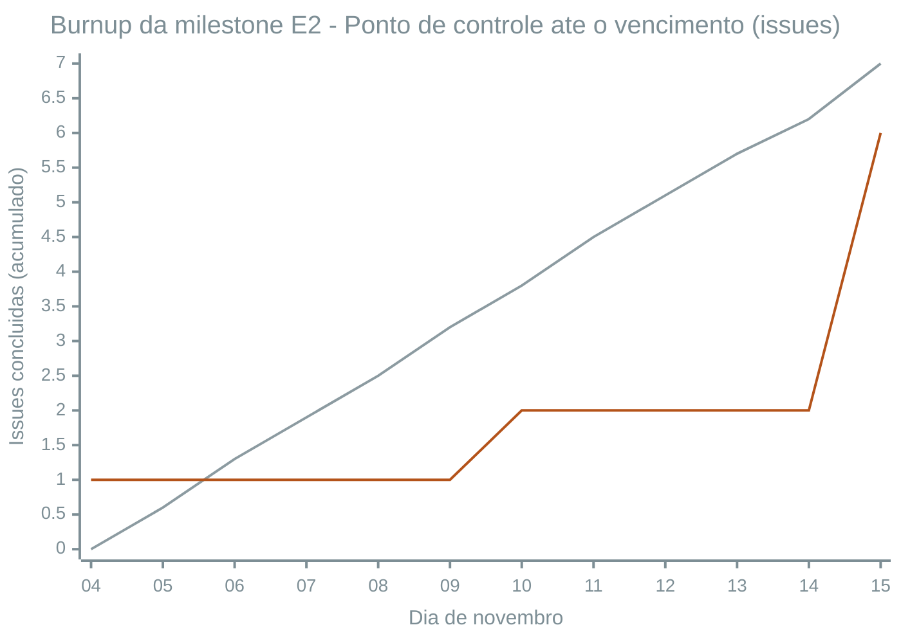
```mermaid
---
config:
  themeVariables:
    xyChart:
      plotColorPalette: "#8C9BA1, #B4531A"
      titleColor: "#7D8E95"
      xAxisLabelColor: "#7D8E95"
      xAxisTitleColor: "#7D8E95"
      xAxisLineColor: "#7D8E95"
      xAxisTickColor: "#7D8E95"
      yAxisLabelColor: "#7D8E95"
      yAxisTitleColor: "#7D8E95"
      yAxisLineColor: "#7D8E95"
      yAxisTickColor: "#7D8E95"
      backgroundColor: "transparent"
---
xychart-beta
    title "Burnup da milestone E2 - Ponto de controle ate o vencimento (issues)"
    x-axis "Dia de novembro" [04, 05, 06, 07, 08, 09, 10, 11, 12, 13, 14, 15]
    y-axis "Issues concluidas (acumulado)" 0 --> 7
    line [0, 0.6, 1.3, 1.9, 2.5, 3.2, 3.8, 4.5, 5.1, 5.7, 6.2, 7]
    line [1, 1, 1, 1, 1, 1, 2, 2, 2, 2, 2, 6]
```

_Figura 18 - Burnup da milestone "E2 - Ponto de controle (Fase 3)" até o vencimento, em 15/11, às 21h: linha cinza = planejado (7 issues distribuídas de forma linear) e linha terracota = concluído (#14 em 04/11, #21 em 10/11, data declarada, e #20, #22, #23 e #24 em 15/11, pelo PR #33). A #25 ficou aberta. Indicador CP1. Fonte: API de issues do GitHub e [`linha-de-base-e2.csv`](https://github.com/FCTE-Qualidade-de-Software-1/2026-2_T02_FRANCES_ALLEN/blob/main/dados/gestao/linha-de-base-e2.csv)._

## 9. Ciclo 5 (parcial): 16/11 a 19/11

Coleta parcial do ciclo da entrega final. A coleta de quarta-feira, 18/11, não foi feita no dia; ela foi feita em **19/11, com data de corte às 10h55**, a partir do `git log` de todos os branches publicados, da API do GitHub e do `esforco.csv`. Além do escopo previsto para a quarta-feira (CP1, CP2, DP2 e horas), a coleta traz uma prévia das demais métricas, que fecham em 22/11.

### 9.1 Contexto

| Item | Registro |
|------|----------|
| Milestone "E2 - Entrega final" | 6 issues (#26 a #31), **26 h** estimadas (R$1.300), com vencimento em 21/11, às 21h; a entrega na disciplina é em 22/11. Nenhuma fechada na data de corte |
| Trabalho fora do `main` | 11 dos 12 commits do ciclo estão em **três branches sem PR**: `larissa/g1-dia1` (8 commits, coleta do G1, #26), `fase-4/p6-pagina-e-gestao` (1, estrutura da página da Fase 4, #31) e `docs/fase-3-cronograma-e-correcoes-e1` (2, inventários do G2 por inspeção, #27, num branch antigo já integrado pelo PR #32). Só o [`bbd77f9`](https://github.com/FCTE-Qualidade-de-Software-1/2026-2_T02_FRANCES_ALLEN/commit/bbd77f9) (adaptação da D13) entrou no `main` |
| Trabalho feito e não fechado | #26: dias 1 e 2 do G1 (T1, T2, T3 e E1) e página de resultados v0.1, no branch. #27: parte de A1 concluída em 19/11, guardada sem commit até a ficha de A2, para preservar a independência dos avaliadores. #28: coleta replanejada para 19 a 21/11 pela D13. #31: estrutura da página da Fase 4, no branch |
| Decisão do ciclo | [D13](decisoes.md#d13-adaptar-a-coleta-com-usuarios-ao-prazo-da-entrega-2), em 19/11: nenhuma das cinco sessões com usuários previstas de 16 a 18/11 aconteceu, e a coleta passou a formulário assíncrono e sessões remotas |
| Horas | Faehzin: 3 h (17/11) e 4 h (19/11) na #27, no `main`. larigs: 2,5 h (17/11) e 3,3 h (18/11) na #26, só no branch `larissa/g1-dia1` |

### 9.2 Medições

| Métrica | Valor | Limite | Situação | Interpretação |
|---------|-------|--------|:--------:|---------------|
| CP1 Comprometido x concluído | Milestone "E2 - Entrega final": `I_conc` = 0 de `I_comp` = 6, com **86,0%** do período decorrido (de 04/11, 14h26, a 21/11, 21h): **desvio de 86,0 p.p.** A #25, da milestone anterior, segue aberta | ≤ 5 p.p. | (AN) | Pior desvio desde a E1. Pela distribuição linear, a milestone devia ter cerca de 5 issues prontas. Há trabalho feito nas #26, #27 e #31, mas em branch ou local, sem fechamento |
| CP2 SPI (hora/valor) | `PV` = 86,0% × 26 h = **22,4 h** · `EV` = 0 h · **SPI = 0,00**. Na E2 inteira (40 h): `PV` = 36,4 h, `EV` = 12 h, **SPI = 0,33** | ≥ 0,90 | (AN) | Nenhum valor da entrega final virou entrega registrada |
| CP2 SPI por contagem | Pela linha de base, #26, #27 e #28 terminavam em 18/11: 0 de 3 fechadas, **SPI = 0,00** | ≥ 0,90 | (AN) | O cronograma foi replanejado (G1 até 20/11 e usuários de 19 a 21/11, pela D13), mas a linha de base não muda depois de o ciclo começar |
| CP2 Variação de prazo | #26, #27 e #28 passaram do fim planejado (18/11). #25: **4,5 dias** após o fim planejado (14/11) | - | (A) | Faltam 2,4 dias para o vencimento da milestone |
| RC1 Variação de esforço | Nenhuma issue fechada no ciclo | -20% a +20% | (--) | Prévia: a #27 já soma **7 h** das 5 h estimadas (+40%) e ainda tem a consolidação pela frente; a #26 soma **5,8 h** das 5 h (+16%), registradas só no branch |
| RC2 CPI | Sem `EV` no ciclo. `AC` registrado: 7 h no `main` (R$350) e 5,8 h só em branch (R$290) | ≥ 0,90 | (--) | Sem entrega não há CPI. Total registrado no `main` desde 18/10: **22 h = R$1.100**, de 2 integrantes |
| RC3 (*proxy*: commits, todos os branches) | larigs 8 (**66,7%**) · Faehzin 3 (**25,0%**) · LucasAvelar2711 1 (**8,3%**) · demais 0 | 13% a 20% | (AN) | Três integrantes com commit. Guilherme-Moura não tem commit desde 26/10, GuilhermeMM3 desde 18/10, e MrBolt2005 nunca teve; parte do trabalho deles foi assumida pela D12 |
| DP1 *Lead time* | Nenhuma fechada no ciclo. Abertas: 7 (#25 a #31), com idade média de **14,9 dias** | ≤ 3 dias | (AN) | As issues da Fase 4 estão abertas desde 04/11, de propósito (D10), mas já vencem nesta semana |
| DP2 Razão saída/chegada | **0 chegadas** e **0 saídas**: razão indefinida e vazão zero | ≥ 0,90 | (A) | Nenhuma issue andou no GitHub no ciclo, embora o repositório tenha 12 commits |
| DP2 WIP | **7 abertas**, **1,2 por integrante** | ≤ 2 por integrante | (OK) | Dentro do limite, mas todas vencem até 22/11 |
| DP3 Índice de pico | 7 de 12 commits em 18/11 = **58,3%**. 3 dias ativos em 4 (17, 18 e 19/11) | ≤ 40% | (A) | Melhor distribuição dos ciclos medidos, ainda acima do limite |
| DP4 Retrabalho | Por commit: 3 de 12 = **25,0%** ([`3622c7a`](https://github.com/FCTE-Qualidade-de-Software-1/2026-2_T02_FRANCES_ALLEN/commit/3622c7a), correção de chave no script do G1; [`3c7d86a`](https://github.com/FCTE-Qualidade-de-Software-1/2026-2_T02_FRANCES_ALLEN/commit/3c7d86a), ajuste de horas; `bbd77f9`, realinhamento à D13). Por PR: nenhum PR no ciclo | ≤ 20% | (A) | Retrabalho perto do limite. Sem PR, os três branches não passam por revisão |
| Rastreabilidade | 1 de 12 commits cita issue ([`b398fc9`](https://github.com/FCTE-Qualidade-de-Software-1/2026-2_T02_FRANCES_ALLEN/commit/b398fc9), #31). 0 PRs abertos | 100% dos PRs ligados a issue e revisados | (AN) | O fluxo de PR do ciclo 4 não se repetiu: o trabalho do ciclo está em branches sem PR, invisível ao CP1 até o merge |

### 9.3 Gráficos

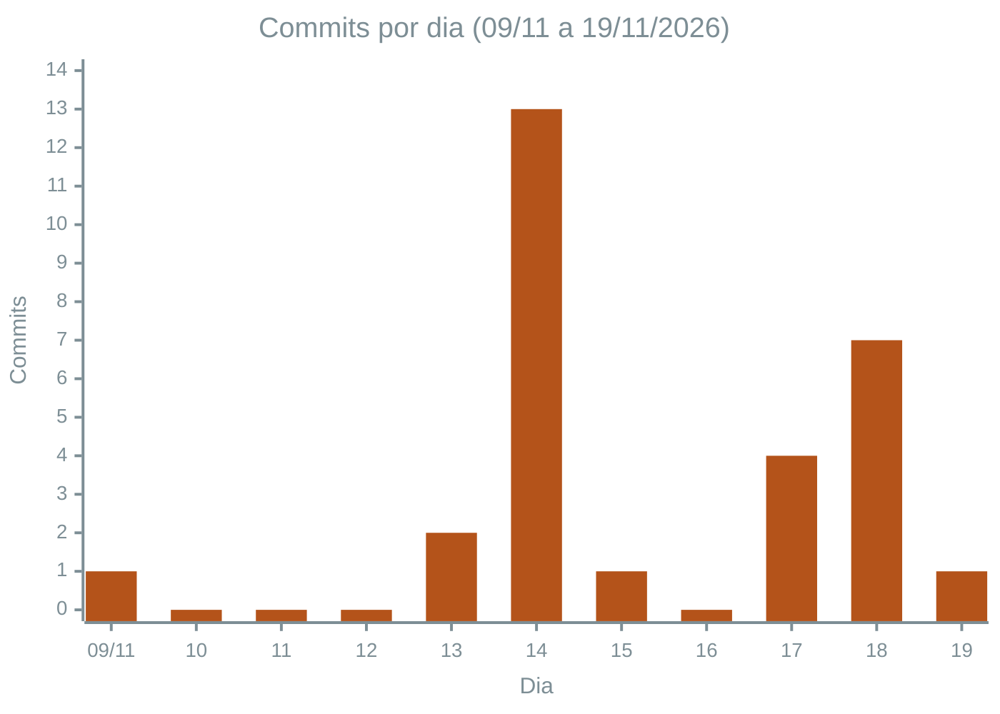
```mermaid
---
config:
  themeVariables:
    xyChart:
      plotColorPalette: "#B4531A"
      titleColor: "#7D8E95"
      xAxisLabelColor: "#7D8E95"
      xAxisTitleColor: "#7D8E95"
      xAxisLineColor: "#7D8E95"
      xAxisTickColor: "#7D8E95"
      yAxisLabelColor: "#7D8E95"
      yAxisTitleColor: "#7D8E95"
      yAxisLineColor: "#7D8E95"
      yAxisTickColor: "#7D8E95"
      backgroundColor: "transparent"
---
xychart-beta
    title "Commits por dia (09/11 a 19/11/2026)"
    x-axis "Dia" ["09/11", "10", "11", "12", "13", "14", "15", "16", "17", "18", "19"]
    y-axis "Commits" 0 --> 14
    bar [1, 0, 0, 0, 2, 13, 1, 0, 4, 7, 1]
```

_Figura 19 - Commits por dia nos ciclos 4 e 5, sem os commits de merge, em todos os branches publicados (29 commits; 19/11 até as 10h55). O pico de 14/11 é o PR #33, na véspera do vencimento da Fase 3. Dos 12 commits de 17 a 19/11, 11 estão em branches sem PR. Indicador DP3. Fonte: [`commits.csv`](https://github.com/FCTE-Qualidade-de-Software-1/2026-2_T02_FRANCES_ALLEN/blob/main/dados/gestao/commits.csv)._

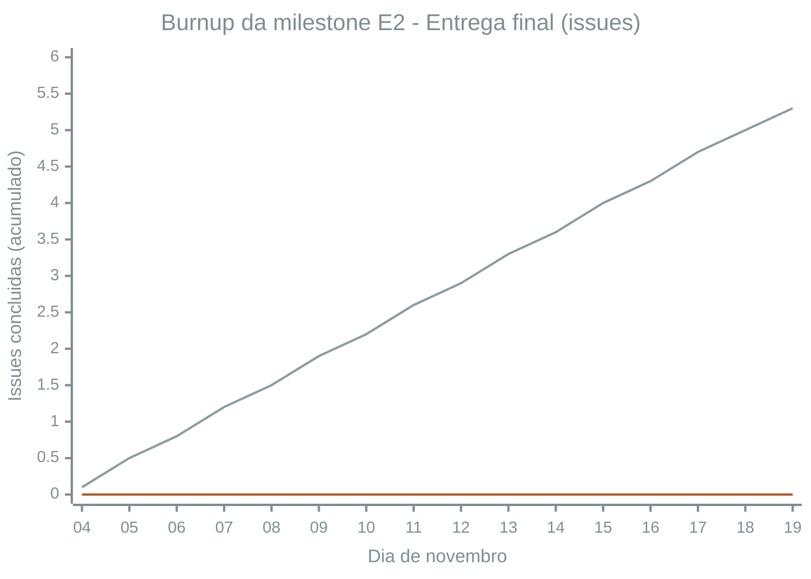
```mermaid
---
config:
  themeVariables:
    xyChart:
      plotColorPalette: "#8C9BA1, #B4531A"
      titleColor: "#7D8E95"
      xAxisLabelColor: "#7D8E95"
      xAxisTitleColor: "#7D8E95"
      xAxisLineColor: "#7D8E95"
      xAxisTickColor: "#7D8E95"
      yAxisLabelColor: "#7D8E95"
      yAxisTitleColor: "#7D8E95"
      yAxisLineColor: "#7D8E95"
      yAxisTickColor: "#7D8E95"
      backgroundColor: "transparent"
---
xychart-beta
    title "Burnup da milestone E2 - Entrega final (issues)"
    x-axis "Dia de novembro" [04, 05, 06, 07, 08, 09, 10, 11, 12, 13, 14, 15, 16, 17, 18, 19]
    y-axis "Issues concluidas (acumulado)" 0 --> 6
    line [0.1, 0.5, 0.8, 1.2, 1.5, 1.9, 2.2, 2.6, 2.9, 3.3, 3.6, 4.0, 4.3, 4.7, 5.0, 5.3]
    line [0, 0, 0, 0, 0, 0, 0, 0, 0, 0, 0, 0, 0, 0, 0, 0]
```

_Figura 20 - Burnup da milestone "E2 - Entrega final (Fase 4 e artigo v2)" até a data de corte: linha cinza = planejado (6 issues distribuídas de forma linear de 04/11 até o vencimento, em 21/11, às 21h) e linha terracota = concluído. Em 19/11 o plano previa 5,3 issues, e nenhuma fechou. Indicador CP1. Fonte: API de issues do GitHub e `linha-de-base-e2.csv`._

```mermaid
---
config:
  themeVariables:
    xyChart:
      plotColorPalette: "#0B5563, #B4531A"
      titleColor: "#7D8E95"
      xAxisLabelColor: "#7D8E95"
      xAxisTitleColor: "#7D8E95"
      xAxisLineColor: "#7D8E95"
      xAxisTickColor: "#7D8E95"
      yAxisLabelColor: "#7D8E95"
      yAxisTitleColor: "#7D8E95"
      yAxisLineColor: "#7D8E95"
      yAxisTickColor: "#7D8E95"
      backgroundColor: "transparent"
---
xychart-beta
    title "Horas da E2 por integrante - planejadas x registradas ate 19/11"
    x-axis ["Faehzin", "larigs", "MrBolt2005", "Guilherme-Moura", "LucasAvelar2711", "GuilhermeMM3"]
    y-axis "Horas" 0 --> 13
    bar [9, 7, 7, 6, 6, 5]
    line [12, 9.8, 0, 0, 0, 0]
```

_Figura 21 - Horas da E2 por integrante: barras = horas estimadas nas issues de cada um (40 h; Faehzin com #14, #21 e #27) e linha = horas registradas no `esforco.csv` desde 04/11, incluindo as 5,8 h da larigs que estão só no branch `larissa/g1-dia1`. Faehzin já passou da estimativa, e LucasAvelar2711, que escreveu quatro métodos pela D12, não tem nenhuma hora registrada. Indicadores RC1 e RC3. Fonte: [`esforco.csv`](https://github.com/FCTE-Qualidade-de-Software-1/2026-2_T02_FRANCES_ALLEN/blob/main/dados/gestao/esforco.csv) e `linha-de-base-e2.csv`._

### 9.4 Leitura dos ciclos 4 e 5

1. **A Fase 3 foi recuperada no vencimento.** A D11 e a D12 tiveram efeito: o desvio do CP1 caiu de 54,0 para 14,3 p.p., o SPI subiu de 0,35 para 0,86, e quatro issues fecharam por `Closes` num PR. O custo foi a rajada (13 commits na véspera) e a concentração (76,5% dos commits do ciclo em um integrante).
2. **A entrega final repete o padrão da E1.** Com 86% do período decorrido, 0 de 6 issues fechadas e SPI de 0,00. Há trabalho real (dados do G1, parte de A1 do G2, página da Fase 4), mas fora do `main` e sem fechamento. Se nada fechar até 21/11, todo o valor da E2 entra no último dia, como aconteceu na E1.
3. **O trabalho voltou para branches, mas sem PR.** É melhor que commitar direto no `main`, mas sem PR não há revisão nem `Closes`, e o CP1 não enxerga o que foi feito.
4. **As horas seguem vindo de 2 de 6 integrantes,** e as duas issues medidas estouraram a estimativa (+100% e +50%). A #27 já passou da estimativa antes de fechar.
5. **Ações sugeridas para a equipe antes da coleta de 22/11:** abrir um PR com `Closes #N` para cada branch até 20/11; dividir ou fechar a #25 e fechar a milestone "E2 - Ponto de controle"; registrar as horas ao fechar cada issue.

## 10. Próxima coleta

| Ciclo | Data | O que coletar | Situação |
|-------|------|---------------|----------|
| 2 (completo) | Domingo, 01/11/2026 | Todas as métricas | **Realizada retroativamente em 13/11.** Registrada na seção 5 |
| 3 | 04/11 e 08/11/2026 | Todas as métricas, mais a verificação da D08, D09 e D10 | **Realizada retroativamente em 13/11.** Registrada na seção 6 |
| 4 (parcial) | 11/11/2026 | CP1, CP2 e DP2 | **Realizada em 13/11**, com o valor de 11/11 recalculado. Registrada na seção 7 |
| 4 (completo) | Domingo, 15/11/2026 | Todas as métricas, o fechamento da milestone "E2 - Ponto de controle" e a verificação da D11 | **Realizada retroativamente em 19/11.** Registrada na seção 8 |
| 5 (parcial) | Quarta-feira, 18/11/2026 | CP1 e DP2 da milestone "E2 - Entrega final" e horas das issues fechadas | **Realizada em 19/11**, com corte às 10h55. Registrada na seção 9 |
| 5 (completo) | Domingo, 22/11/2026 | Todas as métricas, o fechamento das milestones "E2 - Ponto de controle" e "E2 - Entrega final", e a verificação da D12 e da D13 | Pendente |

## 11. Evolução entre os ciclos

Comparação dos ciclos 0 a 5 em cada indicador, para mostrar o que melhorou, o que piorou e o que ficou igual. O ciclo 4 aparece com os valores do fechamento (seção 8); o ciclo 5 é parcial (até 19/11) e será refeito na coleta completa de 22/11. Quando um ciclo tem dois valores (declarado e registrado, por exemplo), vale o que está no painel da seção 1.

### 11.1 Tendência por indicador

| Indicador | C0 | C1 | C2 | C3 | C4 | C5 (parcial) | Limite | Tendência |
|-----------|:--:|:--:|:--:|:--:|:--:|:------------:|:------:|-----------|
| Métricas mensuráveis (de 9) | 3 | 6 | 8 | 7 | **9** | 7 | 9 | **Cai em C5** porque nenhuma issue fechou: RC1 e RC2 dependem de entrega com horas |
| Métricas em ação necessária (AN) | 3 | 5 | 5 | 6 | 7 | 4 | 0 | **Piora em C4.** A queda de C5 vem de métricas que deixaram de ser medidas, não de melhora |
| Métricas em OK | 0 | 0 | 2 | 1 | 0 | 0 | 9 | **Nenhuma desde C4** |
| CP1 desvio (p.p.) | - | 88,9 | 0,0 | 24,7 | 14,3 | 86,0 | ≤ 5 | **Recupera em C4** (54,0 p.p. em 13/11, 14,3 no vencimento) e **dispara em C5**, já na milestone da entrega final |
| CP2 SPI | - | 0,05 | 1,00 | 0,37 | 0,86 | 0,00 | ≥ 0,90 | **Melhor valor real em C4.** O 1,00 de C2 é saturação; C5 não tem entrega |
| RC1 TVE | - | - | - | - | +100% (#20) e +50% (#21) | - | ±20% | **Estouro** nas duas issues com horas |
| RC2 CPI | - | - | - | - | 0,57 | - | ≥ 0,90 | **Um valor só**, abaixo do limite |
| RC3 maior participação (*proxy*: commits) | 34,8% | 66,7% | 66,7% | 50,0% | 76,5% | 66,7% | 13% a 20% | **Concentração alta e constante.** Muda quem concentra, conforme a D12 |
| RC3 integrantes com commit no ciclo | 5 de 6 | 2 de 6 | 2 de 6 | 2 de 6 | 3 de 6 | 3 de 6 | 6 de 6 | **Leve melhora** depois de C3 |
| RC3 carga planejada dentro de 13% a 20% | - | 2 de 6 | - | 6 de 6 | 6 de 6 | 6 de 6 | 6 de 6 | **Constante.** O plano está equilibrado, a execução registrada não |
| DP1 *lead time* das fechadas (dias) | - | 3,1 | 9,3 | 16,0 | 10,8 | - | ≤ 3 | **Acima do limite em todo ciclo** com fechamento |
| DP2 WIP por integrante | - | 2,7 | 0,0 | 2,0 | 1,2 | 1,2 | ≤ 2 | **Dentro do limite** desde C3 |
| DP3 índice de pico | 82,6% | 100% | 66,7% | 100% | 76,5% | 58,3% | ≤ 40% | **Melhor valor em C5**, ainda acima do limite |
| DP3 dias ativos | 4 de 14 (29%) | 1 de 7 (14%) | 2 de 7 (29%) | 1 de 7 (14%) | 4 de 7 (57%) | 3 de 4 (75%) | - | **Melhora** desde C4 |
| DP4 retrabalho (por commit) | 39,1% | 66,7% | 66,7% | 50,0% | 52,9% | 25,0% | ≤ 20% | **Melhor valor em C5** entre os ciclos com mais de 3 commits |
| Commits no ciclo | 23 | 3 | 3 | 4 | 17 | 12 | - | **Volume volta a subir** na Fase 3 e na Fase 4 |
| Horas registradas com data no ciclo | 6 | 0 | 0 | 2 | 7 | 7 (+5,8 em branch) | - | **Dois integrantes** registram desde C4 |
| PRs integrados / revisados | 1 / 0 | 0 / 0 | 0 / 0 | 0 / 0 | 2 / 0 | 0 / 0 | todos revisados | **Nenhuma revisão formal em nenhum ciclo.** O #33 (C4) teve revisão em comentário |

### 11.2 Gráficos

```mermaid
---
config:
  themeVariables:
    xyChart:
      plotColorPalette: "#0B5563, #B4531A, #8C9BA1"
      titleColor: "#7D8E95"
      xAxisLabelColor: "#7D8E95"
      xAxisTitleColor: "#7D8E95"
      xAxisLineColor: "#7D8E95"
      xAxisTickColor: "#7D8E95"
      yAxisLabelColor: "#7D8E95"
      yAxisTitleColor: "#7D8E95"
      yAxisLineColor: "#7D8E95"
      yAxisTickColor: "#7D8E95"
      backgroundColor: "transparent"
---
xychart-beta
    title "Situação das métricas em cada ciclo"
    x-axis "Ciclo" ["C0", "C1", "C2", "C3", "C4", "C5 (parcial)"]
    y-axis "Métricas (de 9)" 0 --> 9
    line [3, 6, 8, 7, 9, 7]
    line [3, 5, 5, 6, 7, 4]
    line [0, 0, 2, 1, 0, 0]
```

_Figura 22 - Linha azul = métricas mensuráveis, linha terracota = métricas em ação necessária (AN), linha cinza = métricas em OK. Em C4 todas as nove métricas tiveram valor, e sete ficaram em AN. Em C5, RC1 e RC2 deixam de ser mensuráveis porque nenhuma issue fechou. Fonte: painel da seção 1._

```mermaid
---
config:
  themeVariables:
    xyChart:
      plotColorPalette: "#B4531A, #0B5563"
      titleColor: "#7D8E95"
      xAxisLabelColor: "#7D8E95"
      xAxisTitleColor: "#7D8E95"
      xAxisLineColor: "#7D8E95"
      xAxisTickColor: "#7D8E95"
      yAxisLabelColor: "#7D8E95"
      yAxisTitleColor: "#7D8E95"
      yAxisLineColor: "#7D8E95"
      yAxisTickColor: "#7D8E95"
      backgroundColor: "transparent"
---
xychart-beta
    title "CP1 - desvio entre planejado e concluído (p.p.)"
    x-axis "Ciclo" ["C1", "C2", "C3", "C4", "C5 (parcial)"]
    y-axis "Desvio (p.p.)" 0 --> 100
    bar [88.9, 0, 24.7, 14.3, 86.0]
    line [5, 5, 5, 5, 5]
```

_Figura 23 - Barras = desvio do CP1 em pontos percentuais, linha = limite de 5 p.p. C1 e C2 se referem à milestone E1; C3 e C4, à "E2 - Ponto de controle"; C5, à "E2 - Entrega final". O zero de C2 é a saturação da E1 depois do vencimento. Indicador CP1._

```mermaid
---
config:
  themeVariables:
    xyChart:
      plotColorPalette: "#0B5563, #8C9BA1"
      titleColor: "#7D8E95"
      xAxisLabelColor: "#7D8E95"
      xAxisTitleColor: "#7D8E95"
      xAxisLineColor: "#7D8E95"
      xAxisTickColor: "#7D8E95"
      yAxisLabelColor: "#7D8E95"
      yAxisTitleColor: "#7D8E95"
      yAxisLineColor: "#7D8E95"
      yAxisTickColor: "#7D8E95"
      backgroundColor: "transparent"
---
xychart-beta
    title "CP2 - SPI por ciclo"
    x-axis "Ciclo" ["C1", "C2", "C3", "C4", "C5 (parcial)"]
    y-axis "SPI" 0 --> 1.1
    bar [0.05, 1.00, 0.37, 0.86, 0.00]
    line [0.9, 0.9, 0.9, 0.9, 0.9]
```

_Figura 24 - Barras = SPI em horas, linha = limite de 0,90. C1 e C2 são da E1 (42 h); C3 e C4, da "E2 - Ponto de controle" (14 h); C5, da "E2 - Entrega final" (26 h). O 0,86 de C4 é o melhor valor medido antes do vencimento. Indicador CP2._

```mermaid
---
config:
  themeVariables:
    xyChart:
      plotColorPalette: "#B4531A, #0B5563, #8C9BA1"
      titleColor: "#7D8E95"
      xAxisLabelColor: "#7D8E95"
      xAxisTitleColor: "#7D8E95"
      xAxisLineColor: "#7D8E95"
      xAxisTickColor: "#7D8E95"
      yAxisLabelColor: "#7D8E95"
      yAxisTitleColor: "#7D8E95"
      yAxisLineColor: "#7D8E95"
      yAxisTickColor: "#7D8E95"
      backgroundColor: "transparent"
---
xychart-beta
    title "RC3 - concentração do trabalho no repositório"
    x-axis "Ciclo" ["C0", "C1", "C2", "C3", "C4", "C5 (parcial)"]
    y-axis "Participação (%)" 0 --> 100
    bar [34.8, 66.7, 66.7, 50.0, 76.5, 66.7]
    line [20, 20, 20, 20, 20, 20]
    line [16.7, 16.7, 16.7, 16.7, 16.7, 16.7]
```

_Figura 25 - Barras = maior participação de um integrante nos commits do ciclo, linha azul = limite superior da faixa OK (20%), linha cinza = participação ideal (16,7%). A concentração fica acima de 50% desde C1, enquanto a carga planejada da E2 está entre 13,2% e 18,4% para todos. Indicador RC3 (*proxy*: commits)._

```mermaid
---
config:
  themeVariables:
    xyChart:
      plotColorPalette: "#0B5563, #B4531A"
      titleColor: "#7D8E95"
      xAxisLabelColor: "#7D8E95"
      xAxisTitleColor: "#7D8E95"
      xAxisLineColor: "#7D8E95"
      xAxisTickColor: "#7D8E95"
      yAxisLabelColor: "#7D8E95"
      yAxisTitleColor: "#7D8E95"
      yAxisLineColor: "#7D8E95"
      yAxisTickColor: "#7D8E95"
      backgroundColor: "transparent"
---
xychart-beta
    title "Commits e dias ativos por ciclo"
    x-axis "Ciclo" ["C0", "C1", "C2", "C3", "C4", "C5 (parcial)"]
    y-axis "Quantidade" 0 --> 25
    bar [23, 3, 3, 4, 17, 12]
    line [4, 1, 2, 1, 4, 3]
```

_Figura 26 - Barras = commits do ciclo (sem merge), linha = dias com pelo menos um commit. O volume voltou a subir em C4 e C5. O ciclo 0 tem 14 dias, os demais 7, e o ciclo 5 parcial tem 4. Indicador DP3._

```mermaid
---
config:
  themeVariables:
    xyChart:
      plotColorPalette: "#B4531A, #0B5563, #8C9BA1, #C9D3D6"
      titleColor: "#7D8E95"
      xAxisLabelColor: "#7D8E95"
      xAxisTitleColor: "#7D8E95"
      xAxisLineColor: "#7D8E95"
      xAxisTickColor: "#7D8E95"
      yAxisLabelColor: "#7D8E95"
      yAxisTitleColor: "#7D8E95"
      yAxisLineColor: "#7D8E95"
      yAxisTickColor: "#7D8E95"
      backgroundColor: "transparent"
---
xychart-beta
    title "DP3 e DP4 - pico de atividade e retrabalho (%)"
    x-axis "Ciclo" ["C0", "C1", "C2", "C3", "C4", "C5 (parcial)"]
    y-axis "Percentual" 0 --> 100
    line [82.6, 100, 66.7, 100, 76.5, 58.3]
    line [39.1, 66.7, 66.7, 50.0, 52.9, 25.0]
    line [40, 40, 40, 40, 40, 40]
    line [20, 20, 20, 20, 20, 20]
```

_Figura 27 - Linha terracota = índice de pico (DP3), linha azul = retrabalho por commit (DP4), linha cinza = limite do pico (40%), linha cinza-clara = limite do retrabalho (20%). C5 tem os melhores valores das duas curvas, ainda acima dos limites. Indicadores DP3 e DP4._

```mermaid
---
config:
  themeVariables:
    xyChart:
      plotColorPalette: "#B4531A, #8C9BA1"
      titleColor: "#7D8E95"
      xAxisLabelColor: "#7D8E95"
      xAxisTitleColor: "#7D8E95"
      xAxisLineColor: "#7D8E95"
      xAxisTickColor: "#7D8E95"
      yAxisLabelColor: "#7D8E95"
      yAxisTitleColor: "#7D8E95"
      yAxisLineColor: "#7D8E95"
      yAxisTickColor: "#7D8E95"
      backgroundColor: "transparent"
---
xychart-beta
    title "DP1 - lead time médio das issues fechadas (dias)"
    x-axis "Ciclo" ["C1", "C2", "C3", "C4"]
    y-axis "Dias" 0 --> 18
    bar [3.1, 9.3, 16.0, 10.8]
    line [3, 3, 3, 3]
```

_Figura 28 - Barras = *lead time* médio das issues fechadas no ciclo, linha = limite de 3 dias. O pico de C3 (16,0 dias) é o fechamento no GitHub, em 04/11, das issues da E1 declaradas prontas em 28/10. C4 são as cinco issues de método da Fase 3. C5 não aparece porque nenhuma issue fechou até o corte. Indicador DP1._

```mermaid
---
config:
  themeVariables:
    xyChart:
      plotColorPalette: "#0B5563, #8C9BA1"
      titleColor: "#7D8E95"
      xAxisLabelColor: "#7D8E95"
      xAxisTitleColor: "#7D8E95"
      xAxisLineColor: "#7D8E95"
      xAxisTickColor: "#7D8E95"
      yAxisLabelColor: "#7D8E95"
      yAxisTitleColor: "#7D8E95"
      yAxisLineColor: "#7D8E95"
      yAxisTickColor: "#7D8E95"
      backgroundColor: "transparent"
---
xychart-beta
    title "DP2 - trabalho em andamento por integrante"
    x-axis "Ciclo" ["C1", "C2", "C3", "C4", "C5 (parcial)"]
    y-axis "Issues abertas por integrante" 0 --> 3
    bar [2.7, 0, 2.0, 1.2, 1.2]
    line [2, 2, 2, 2, 2]
```

_Figura 29 - Barras = issues abertas por integrante na data de corte, linha = limite de 2 da D04. C2 é zero porque o backlog da E1 esvaziou e o da E2 ainda não existia; a partir de C3 o WIP fica no limite ou abaixo dele. Indicador DP2._

### 11.3 Síntese

- **Melhorou:** o cumprimento da Fase 3 no vencimento (CP1 com 14,3 p.p. e SPI de 0,86, os melhores da E2), o primeiro fechamento de issues pelo PR (`Closes`), a distribuição dos commits no tempo (3 dias ativos em 4 em C5) e o WIP (dentro do limite desde C3).
- **Piorou:** a milestone da entrega final (0 de 6 issues com 86% do período) e o esforço das issues medidas (TVE de +100% e +50%, CPI de 0,57).
- **Ficou igual:** nenhuma revisão formal de PR, horas de só 2 de 6 integrantes, concentração do trabalho registrado acima de 50% e a rajada de commits na véspera dos vencimentos.

## Histórico de versão

| Versão | Data | Descrição | Autor(a) | Revisor(a) |
|--------|------|-----------|----------|------------|
| 0.1 | 05/10/2026 | Criação da estrutura do documento | Gabriel Fae | - |
| 0.2 | 16/10/2026 | Reorganização da documentação por fases do processo de avaliação | Gabriel Fae | - |
| 0.3 | 25/10/2026 | Registro dos ciclos 0 (retroativo) e 1, painel de indicadores, gráficos e síntese | Gabriel Fae | - |
| 0.4 | 28/10/2026 | Coleta parcial do ciclo 2 (CP1, CP2, DP2 e horas retroativas), correção retroativa de DP3 e DP4 do ciclo 1, preenchimento de DP1 e DP2 do ciclo 1 e situação da coleta completa de 01/11 | Gabriel Fae | - |
| 0.5 | 28/10/2026 | Cinco gráficos de esforço, entrega e custo: volume por integrante no ciclo 0, horas planejadas x entregues e horas por categoria no ciclo 1, custo da E1 em reais e simulação de pagamento por integrante no ciclo 2 | Gabriel Fae | - |
| 0.6 | 13/11/2026 | Fechamento retroativo do ciclo 2, ciclo 3 medido retroativamente e coleta parcial do ciclo 4 a partir do `git log` e da API do GitHub, com painel estendido e três gráficos novos | Gabriel Fae | - |
| 0.7 | 13/11/2026 | Linha de base de horas da E2 (40 h) aplicada a CP2, RC1 e RC2 dos ciclos 3 e 4, e seção 9 com a evolução entre os ciclos: tabela de tendências e oito gráficos | Gabriel Fae | - |
| 0.8 | 19/11/2026 | Fechamento retroativo do ciclo 4 com a verificação da D11, coleta parcial do ciclo 5 (corte em 19/11, às 10h55), quatro gráficos novos e evolução estendida até o ciclo 5 | Gabriel Fae | - |
